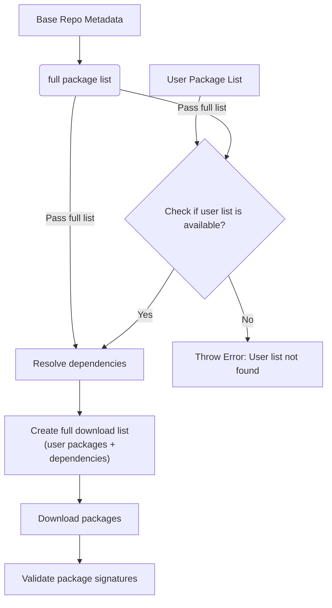
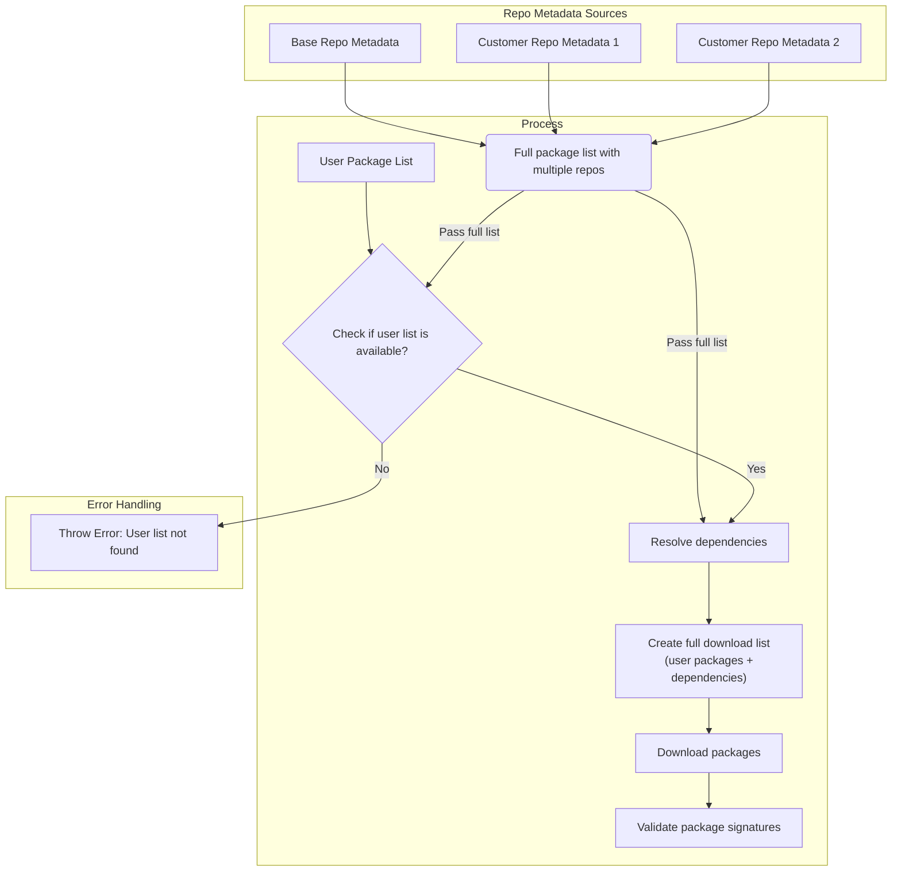

# Image Composer Tool with Multiple Package Repo Support

## Introduction
A major feature of the Image Composer Tool (ICT) is its ability to let users add additional package repositories to the OS build. These repositories often contain in-house proprietary packages or upstream packages pending integration. By supporting multiple repositories, the tool enables rapid deployment, experimentation, and validation of custom software alongside standard OS components.

The following are the key aspects of the Multiple Package Repo :

### Configuration:
Describes how to add and configure extra package repositories, enabling ICT to access and pull custom packages that are not available in the base repository.
### Package Conflict Priority Consideration:
Outlines how ICT determines which package to use when duplicates exist across repositories, prioritizing user-specified order and base repository integrity.
### Archtectural Design:
Describes how the design integrates with ICT's existing package and dependency pre-download framework, enabling dependency resolution without relying on package managers like APT or TDNF.


## A. Configuration
Users can specify additional package repositories in the ICT user template, for example:

```
   ...
   additionalrepo:
      intel1: "https://www.intel.com/repo1"  # Add new package repo URL
      intel2: "https://www.intel.com/repo2"  # Add another new package repo URL

   packages:
      - intelpackage01   # Package from intel1 repo
      - intelpackage02   # Package from intel2 repo
      - systemd-boot     # Package from base repo
   ...
```

Each repository must follow the standard Debian or RPM structure, including all required metadata. ICT performs sanity checks to ensure repository URLs are valid before proceeding.

Debian repo setup: https://wiki.debian.org/DebianRepository/Setup  
RPM repo setup: https://wiki.centos.org/HowTos/CreateLocalRepos

## B. Package Conflict Priority Consideration:

When multiple repositories contain packages with the same name, ICT uses a simple two-rule priority system for package selection.

#### Priority Rules

ICT follows these straightforward rules when resolving package conflicts:

1. **Version Priority**: If the same package exists in multiple repositories with different versions, ICT always selects the package with the latest version number, regardless of which repository contains it.

2. **Repository Order Priority**: If the same package exists in multiple repositories with identical versions, ICT follows this priority order:
   - Base OS repository (highest priority)
   - Additional repositories in the order they appear in configuration

#### Resolution Process

```
Decision Flow:
1. Check if package versions differ → Select latest version
2. If versions are identical → Follow repository priority order:
   - Base OS repository
   - intel1 (first additional repo in config)
   - intel2 (second additional repo in config)
   - ... (subsequent repos in config order)
```

#### Conflict Resolution Examples

**Example 1: Different versions across repositories**
- Base repo contains: `curl-7.68.0`
- intel1 repo contains: `curl-8.0.1`
- **Result**: ICT selects `curl-8.0.1` from intel1 (latest version rule)

**Example 2: Same version in multiple repositories**
- Base repo contains: `mypackage-1.0.0`
- intel1 repo contains: `mypackage-1.0.0`
- intel2 repo contains: `mypackage-1.0.0`
- **Result**: ICT selects `mypackage-1.0.0` from base repo (repository order priority)

**Example 3: Mixed scenario**
- intel1 repo contains: `testpackage-2.0.0`
- intel2 repo contains: `testpackage-1.5.0`
- **Result**: ICT selects `testpackage-2.0.0` from intel1 (latest version rule)

This simplified priority system ensures users always get the most recent package versions while maintaining predictable behavior for identical versions.

### Dependencies Package

#### What are Dependencies?

In simple terms, dependencies are other packages that a software package needs to work properly. Think of it like cooking a recipe - if you want to make a cake, you need ingredients like flour, eggs, and sugar. Similarly, when you install a software package, it often needs other software packages (dependencies) to function correctly.

For example:
- A web browser might depend on graphics libraries to display images
- A media player might depend on codec packages to play different video formats
- A database application might depend on networking libraries to communicate over the internet

#### Dependency Resolution in Multi-Repository Environment

The dependency resolution system ensures package consistency by maintaining repository affinity between parent packages and their dependencies.

#### Dependency Resolution Rules

1. **Repository Affinity**: Dependencies are always pulled from the same repository as their parent package, regardless of newer versions available in other repositories.

2. **Dependency Chain Consistency**: All dependencies in a package's dependency tree maintain the same repository source as the root parent package.

3. **Conflict Prevention**: This approach prevents version mismatches and compatibility issues that could arise from mixing dependencies across different repositories.

#### Dependency Resolution Examples

**Example 1: Parent package with dependencies**
- User specifies: `myapp-2.0.0` (available in intel1 repo)
- `myapp-2.0.0` depends on: `libssl-1.1.0` and `libcrypto-1.1.0`
- Base repo contains: `libssl-1.2.0` (newer version)
- intel1 repo contains: `libssl-1.1.0` and `libcrypto-1.1.0`
- **Result**: ICT pulls `libssl-1.1.0` and `libcrypto-1.1.0` from intel1 repo (same as parent)

**Example 2: Transitive dependencies**
- User specifies: `customtools-1.0.0` (from intel2 repo)
- `customtools-1.0.0` → depends on `libxml-2.0.0` (from intel2)
- `libxml-2.0.0` → depends on `zlib-1.2.5` (available in base repo as 1.2.8 and intel2 as 1.2.5)
- **Result**: All dependencies (`libxml-2.0.0`, `zlib-1.2.5`) pulled from intel2 repo

**Example 3: Missing dependencies**
- User specifies: `specialpackage-1.0.0` (from intel1 repo)
- `specialpackage-1.0.0` depends on `missinglib-1.0.0`
- `missinglib-1.0.0` not available in intel1 repo but exists in base repo
- **Result**: ICT reports dependency resolution failure and suggests adding missing package to intel1 repo or using alternative

#### Benefits of Repository Affinity

- **Consistency**: Ensures all related packages come from the same tested source
- **Compatibility**: Prevents version conflicts between interdependent packages  
- **Predictability**: Users know exactly which repository provides their complete package stack
- **Maintainability**: Simplifies troubleshooting when issues arise with custom packages

This dependency resolution strategy maintains package integrity while supporting the multi-repository architecture.

### Architectural Design:
The design integrates with ICT's existing package and dependency pre-download framework,

<div style="display: flex; gap: 20px; flex-wrap: wrap;">

<div style="flex: 1; min-width: 300px;">

**Single Repository Flow (Original)**


</div>

<div style="flex: 1; min-width: 300px;">

**Multiple Repository Flow (Enhanced)**


</div>

</div>
