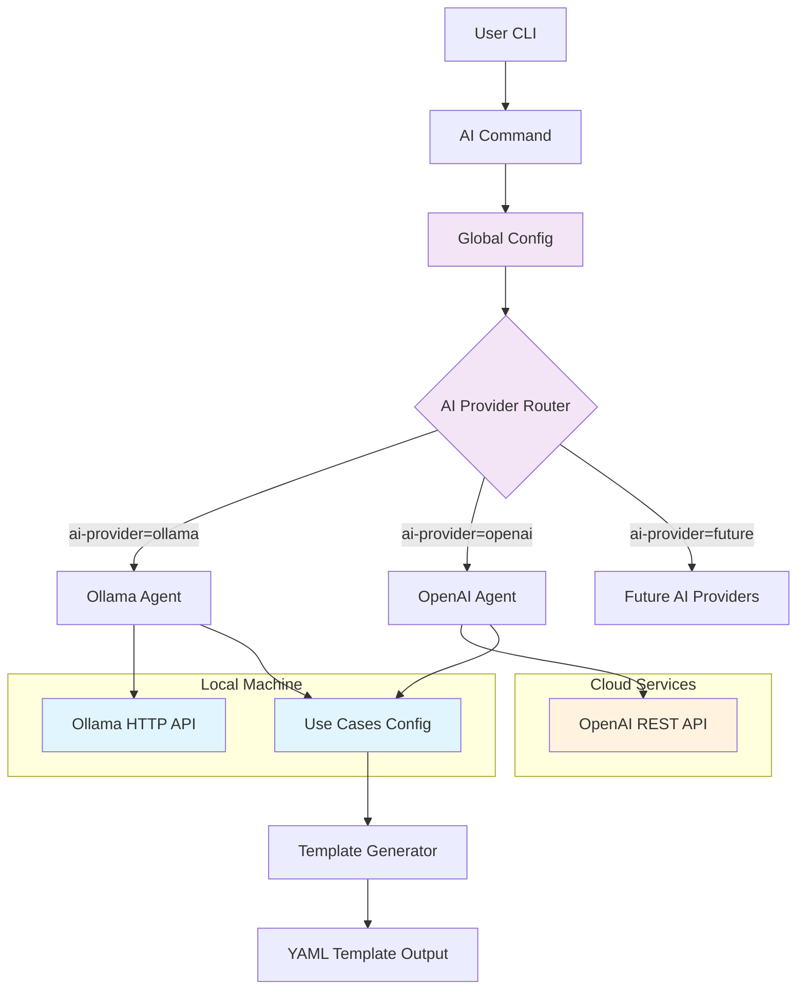
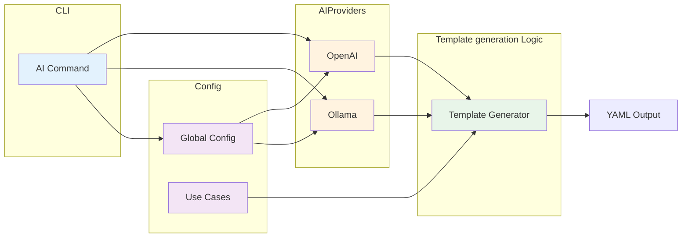
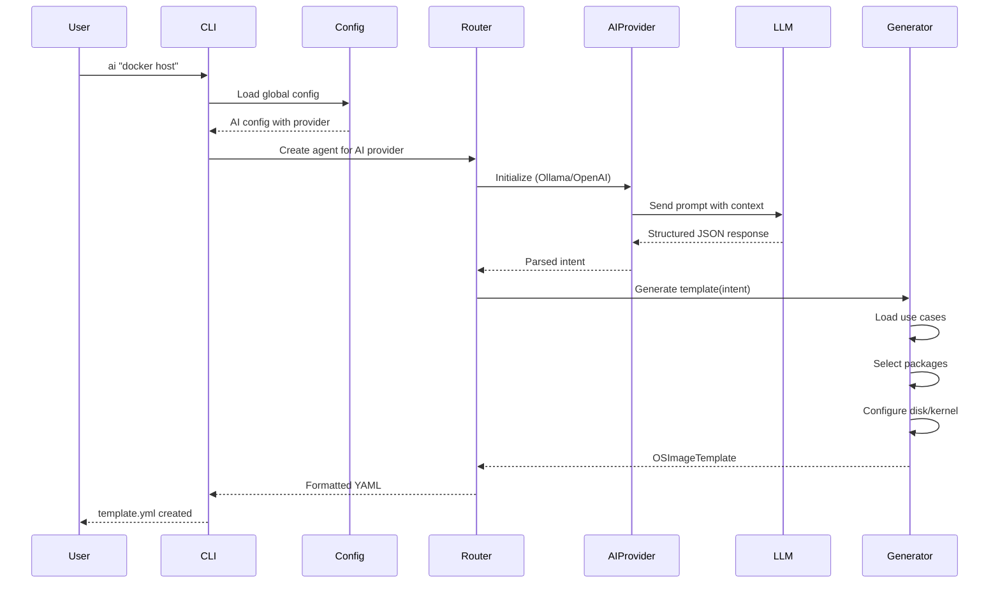
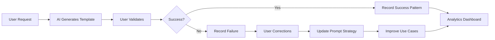

# Architecture Design Record: AI-Powered Template Generation

**Status**: Proposed (Pending Approval)  
**Date**: 2025-10-13  
**Decision Makers**: OS Image Composer Team  
**Technical Story**: Add AI command for natural language template generation

---

## Version History

| Version | Date | Changes | Status |
|---------|------|---------|--------|
| 0.1 | 2025-10-01 | Initial draft | Draft |
| 1.0 | 2025-10-13 | Complete ADR with Phase 1 implementation | Proposed |

---

## Context and Problem Statement

OS Image Composer users must manually create YAML templates with specific package lists, kernel configurations, and disk layouts. This requires:

- Deep knowledge of package ecosystems
- Understanding of distribution-specific package names
- Manual research for optimal package combinations
- Trial-and-error for dependency resolution


**Problem**: How can we enable users to generate OS image templates from natural language descriptions while maintaining flexibility for different AI providers?

---

## Decision Drivers

1. **User Experience**: Enable non-experts to create valid templates quickly
1. **Cost Flexibility**: Support both free (local) and paid (cloud) AI options
1. **Privacy**: Allow users to keep data local or use cloud services
1. **Extensibility**: Easy to add more AI providers in the future
1. **Offline Capability**: Must work without internet access
1. **Quality**: Generate valid, production-ready templates
1. **Maintainability**: Clean architecture that's easy to extend
1. **Intelligence**: AI should intelligently mix packages from multiple use cases

---

## Considered Options

### Option 1: Single AI Provider (Ollama Only)

**Pros**: Simple, free, private  
**Cons**: Limited to local LLMs, requires hardware resources

### Option 2: Single AI Provider (OpenAI Only)

**Pros**: Best quality, no local resources needed  
**Cons**: Costs money, requires internet, privacy concerns

### Option 3: Multi-AI-Provider with Plugin Architecture (**SELECTED**)

**Pros**: Maximum flexibility, future-proof, user choice  
**Cons**: More complex implementation

### Option 4: Rule-Based System Only

**Pros**: No external dependencies, deterministic  
**Cons**: Limited flexibility, hard to maintain

---

## Decision Outcome

**Chosen option**: Multi-AI-Provider Architecture with support for:

- **Ollama** (free, local, open-source)
- **OpenAI** (paid, cloud, high-quality)
- **Extensible design** for future AI providers (Anthropic, Cohere, etc.)


### Rationale

1. **User Freedom**: Users can choose based on their needs (cost, privacy, quality)
1. **Future-Proof**: Easy to add new AI providers as AI landscape evolves
1. **Best of Both Worlds**: Free option available, premium option for those who want it
1. **No Lock-In**: Switch AI providers without code changes
1. **Corporate Friendly**: Supports air-gapped environments (Ollama) and enterprise AI services (OpenAI)

---

## Architecture Design

### High-Level Architecture



### Component Architecture



### Data Flow



---

## AI Package Recommendation Strategy

A critical design decision is how the AI recommends packages. Three approaches were considered:

### Approach 1: Single Use Case Matching (Phase 1 - Initial)

**How it works**: AI identifies ONE use case, uses packages only from that use case.

```text
User: "openvino with web dashboard"
AI: Identifies use_case = "openvino-inference"
Result: Only OpenVINO packages (missing nginx!)
```

**Limitations**:

- Cannot combine multiple use cases
- Limited to predefined package lists
- Misses obvious package combinations

### Approach 2: Multi-Use-Case Mixing (Phase 2 - Recommended)

**How it works**: AI identifies primary + additional use cases, merges their packages.

```
User: "openvino with web dashboard"
AI: {
  "use_case": "openvino-inference",
  "additional_use_cases": ["web-server"],
  "custom_packages": ["grafana"]
}
Result: OpenVINO + nginx + web packages + grafana
```

**Advantages**:
- Intelligent package mixing
- Uses validated use case definitions
- Maintains package quality control
- Allows custom package additions

### Approach 3: Full AI Intelligence (Phase 3 - Future)

**How it works**: AI acts as Linux expert, recommends all packages directly.

```text
User: "openvino with monitoring dashboard"
AI: Analyzes requirements and recommends:
{
  "packages": [
    "openvino", "opencv", "python3",    # Inference
    "nginx", "certbot",                  # Web server
    "grafana", "prometheus",             # Monitoring
    "python3-flask"                      # Dashboard API
  ],
  "reasoning": "OpenVINO for inference, Flask API, Nginx reverse proxy, Grafana for visualization"
}
```


**Advantages**:

- Maximum flexibility
- AI can recommend novel combinations
- Adapts to any user request

**Challenges**:

- May recommend non-existent packages
- Requires robust validation
- Less predictable results


### Decision: Phased Implementation

**Phase 1** (Initial): Single use case matching

- Simple to implement and test
- Validates core architecture
- Provides immediate value

**Phase 2** (Recommended for approval): Multi-use-case mixing

- Significant intelligence improvement
- Maintains quality control
- Balances flexibility and safety

**Phase 3** (Future consideration): Full AI intelligence

- Requires extensive testing
- Consider after Phase 2 is proven
- May require package validation service


---

## Implementation Details

### 1. Configuration Structure

**File**: `os-image-composer.yml`

```yaml
# Existing configuration
workers: 8
cache_dir: ./cache
work_dir: ./workspace

# Add AI configuration section
ai:
  enabled: true
  provider: ollama  # or "openai"
  
  ollama:
    base_url: http://localhost:11434
    model: llama3.1:8b
    temperature: 0.7
    max_tokens: 2000
    timeout: 120
  
  openai:
    api_key: ${OPENAI_API_KEY}
    model: gpt-4o-mini
    temperature: 0.7
    max_tokens: 2000
    timeout: 120
```

### 2. Use Cases Configuration

**File**: `config/use-cases.yml`

```yaml
# OS Image Composer Use Case Definitions

use_cases:
  web-server:
    name: Web Server
    description: HTTP/HTTPS web server configuration
    keywords:
      - web
      - nginx
      - apache
      - http
      - https
    # Common packages (work across all OS versions)
    essential_packages:
      - nginx
      - systemd
      - openssl
    optional_packages:
      - certbot
      - logrotate
    security_packages:
      - fail2ban
    performance_packages:
      - redis
      - memcached
    # OS-specific package overrides (optional)
    os_specific:
      azure-linux-azl3:
        essential_packages:
          - nginx
          - systemd
          - openssl3
        security_packages:
          - ufw
      wind-river-elxr12:
        essential_packages:
          - nginx
          - systemd-base
          - openssl11
        security_packages:
          - iptables-services
      edge-microvisor-toolkit-emt3:
        essential_packages:
          - nginx-light
          - systemd
          - libressl
    kernel:
      default_version: "6.12"
      cmdline: "console=ttyS0,115200 console=tty0 loglevel=7"
    disk:
      default_size: "8GiB"

  openvino-inference:
    name: OpenVINO Inference
    description: AI/ML inference with Intel OpenVINO
    keywords:
      - openvino
      - inference
      - ai
      - ml
      - vision
    essential_packages:
      - systemd
      - python3
      - openvino
      - opencv
    optional_packages:
      - python3-numpy
      - intel-opencl
    security_packages:
      - openssl
      - openssh-server
    # OS-specific overrides for different OpenVINO versions
    os_specific:
      azure-linux-azl3:
        essential_packages:
          - openvino-runtime-2024
          - python3.11
      wind-river-elxr12:
        essential_packages:
          - openvino-runtime-2023
          - python3.9
    kernel:
      default_version: "6.12"
      cmdline: "console=ttyS0,115200 intel_iommu=on"
    disk:
      default_size: "20GiB"
```

**Package Selection Logic**:

1. Start with common packages (work for all OS versions)
2. If target OS is specified and has `os_specific` overrides, use those
3. Merge: OS-specific packages override common packages for matching categories
4. AI can recommend use cases; template generator applies OS-specific logic

---

## AI Provider Comparison

| Feature | Ollama | OpenAI |
|---------|--------|--------|
| **Cost** | Free | ~$0.001 per request |
| **Setup** | Install + download model | API key only |
| **Privacy** | 100% local | Data sent to cloud |
| **Internet** | Not required | Required |
| **Quality** | Very good | Excellent |
| **Speed** | 2-5 seconds | 1-2 seconds |
| **Models** | llama3.1, mistral, etc. | gpt-4o, gpt-4o-mini |
| **Hardware** | 8GB+ RAM | None |
| **Rate Limits** | None | API quota limits |
| **Customization** | Can fine-tune | Limited |

---

## Usage Examples

### Example 1: Using Ollama (Free, Local)

**Step 1**: Enable AI in configuration

Edit `os-image-composer.yml` and add:

```yaml
ai:
  enabled: true
  provider: ollama
  ollama:
    base_url: http://localhost:11434
    model: llama3.1:8b
```

**Step 2**: Install Ollama

```bash
curl -fsSL https://ollama.com/install.sh | sh
ollama pull llama3.1:8b
```

**Step 3**: Generate templates

```bash
# Generate and view
os-image-composer ai "docker host for production"

# Save to file
os-image-composer ai "docker host for production" --output docker-host.yml
```


### Example 2: Using OpenAI (Paid, Cloud)

**Step 1**: Set API key

```bash
export OPENAI_API_KEY="sk-..."
```

**Step 2**: Enable OpenAI in configuration

Edit `os-image-composer.yml` and add:

```yaml
ai:
  enabled: true
  provider: openai
  openai:
    api_key: ${OPENAI_API_KEY}
    model: gpt-4o-mini
```

**Step 3**: Generate templates (same command!)

```bash
os-image-composer ai "docker host for production" --output template.yml
```


### Example 3: Adding Custom Use Case

Edit `config/use-cases.yml`:

```yaml
use_cases:
  gaming-server:
    name: Gaming Server
    keywords: [game, gaming, minecraft, steam]
    essential_packages:
      - systemd
      - game-server-tools
    disk:
      default_size: "50GiB"
```

Use it:

```bash
os-image-composer ai "minecraft gaming server" --output gaming.yml
```


### Example 4: Complex Multi-Use-Case (Phase 2)

```bash
# AI intelligently combines multiple use cases
os-image-composer ai "python web app with redis cache and postgresql database" --output webapp.yml

# Results in packages from:
# - python-web use case
# - Custom additions: redis, postgresql
```

---

## Security Considerations

### 1. API Key Management

**Problem**: OpenAI API keys must be kept secure

**Solution**:

- Use environment variables: `${OPENAI_API_KEY}`
- Never commit keys to version control
- Support `.env` file loading
- Document secure key storage practices


### 2. Data Privacy

**Problem**: Templates might contain sensitive information

**Solution**:

- Default to Ollama (local processing)
- Warn users when using cloud providers
- Document data handling policies
- Allow disabling AI entirely


### 3. Package Validation

**Problem**: AI might recommend non-existent packages

**Mitigation** (Phase 2+):

- Validate packages against repository metadata
- Warn users about unrecognized packages
- Maintain allowlist of known-good packages
- Test generated templates before deployment


---

## Performance Considerations

### Response Time

| Provider | First Request | Subsequent | Notes |
|----------|--------------|------------|-------|
| Ollama | 5-10s | 2-5s | Varies based on the server config. Model loading overhead first time |
| OpenAI | 1-2s | 1-2s | Network latency |

### Resource Usage

**Ollama**:

- RAM: 8GB minimum, 16GB recommended
- Disk: 5-10GB per model
- CPU: Multi-core beneficial

**OpenAI**:

- RAM: Minimal
- Disk: None
- Network: Moderate bandwidth

---

## Testing Strategy

### Integration Tests

- Test end-to-end AI → template → validation flow
- Test both Ollama and OpenAI providers
- Test OS-specific package selection logic
- Test error handling and fallbacks

### E2E Tests

Examples for E2E testing:

```bash
# Full workflow test
os-image-composer ai "web server" --output test.yml
os-image-composer validate test.yml
os-image-composer build test.yml
```

---

## Phase Implementation Plan

### Phase 1: Foundation (For Initial Approval)

**Status**: Implementation Ready  
**Goal**: Establish multi-provider architecture

- Ollama provider implementation
- OpenAI provider implementation
- Provider abstraction interface
- Single use case matching
- YAML output only
- Basic use cases (web-server, python-web, database, embedded, container-host)
- Configuration system
- Schema validation

**Deliverables**:

- Functional `ai` command
- Support for Ollama and OpenAI
- Documentation and ADR

### Phase 2: Enhanced Intelligence (Post-Approval)

**Status**: Planned  
**Goal**: Multi-use-case package mixing

- Enhanced AI prompts for multiple use cases
- Package merging from multiple use cases
- Custom package recommendations
- Package validation against repositories
- Warning system for unknown packages
- Extended use case library (AI/ML, gaming, monitoring)

**Deliverables**:

- Smarter package selection
- Better handling of complex requirements
- Comprehensive use case library

### Phase 3: Advanced Features (Future)

**Status**: Under Consideration  
**Goal**: Full AI intelligence and enterprise features

- Full AI package recommendation (no use case constraints)
- Interactive multi-turn conversations
- Template modification ("add Redis to existing template")
- Explanation mode ("why these packages?")
- Comparison mode ("nginx vs apache for my use case")
- Custom model fine-tuning
- Enterprise: Anthropic Claude support
- Enterprise: Audit logging
- Enterprise: Policy enforcement

---

## Future Considerations

The following questions and enhancements will be addressed in future phases:

### Use Case Management

**Question**: Will `use-cases.yml` be user-editable or system-managed?

**Current State**: Phase 1 provides a predefined set of use cases maintained by the project.

**Future Options**:

#### User-Editable (Recommended for Phase 2)

- Allow users to add custom use cases in `config/use-cases.yml`
- Enable organization-specific package combinations
- Support local overrides without modifying system files
- Example: Users could define "my-company-web-stack" use case
- Add OS-specific package overrides for their distributions

**Note**: OS version differences (azl3, elxr12, emt3) are handled via `os_specific` section in `use-cases.yml`, allowing different package lists per OS without code changes.

**Question**: Is there a feedback mechanism to improve AI responses over time?

**Current State**: Phase 1 has no feedback loop; AI quality depends solely on model training.

**Future Enhancements**:

#### Phase 2: Basic Feedback Collection

- Track successful vs failed template generations
- Log which use cases produce valid images
- Collect metrics:
  - Template validation success rate
  - Build success rate
  - User modifications to AI-generated templates

#### Phase 3: Advanced Learning Loop



**Implementation Options**:

1. **Prompt Engineering Feedback**:
   - Analyze successful templates to refine prompts
   - A/B test different prompt structures
   - Continuously improve use case definitions

2. **Fine-Tuning (Advanced)**:
   - Collect user-approved templates as training data
   - Fine-tune local models (Ollama) on successful examples
   - Organization-specific model customization

3. **Community Feedback**:
   - Share successful use case patterns
   - Crowdsource package combinations
   - Community-contributed use cases

**Recommendation**:

- Phase 2: Implement basic success/failure metrics locally
- Phase 3: Add interactive feedback with privacy controls
- Future: Community feedback platform (opt-in)


These considerations will be evaluated and prioritized based on user feedback and Phase 1 adoption metrics.

---

## Migration Guide

### For Existing Users

No migration needed - AI command is additive. Existing workflow unchanged:

```bash
# Still works exactly as before
os-image-composer build my-template.yml
```

### Enabling AI Features

**Step 1**: Update configuration

Edit `os-image-composer.yml`, add AI section:

```yaml
ai:
  enabled: true
  provider: ollama
  ollama:
    base_url: http://localhost:11434
    model: llama3.1:8b
```

**Step 2**: Install Ollama (if using ollama provider)

```bash
curl -fsSL https://ollama.com/install.sh | sh
ollama pull llama3.1:8b
```

**Step 3**: Start using AI

```bash
os-image-composer ai "your request here" --output template.yml
```

---

## Consequences

### Positive

- **User Productivity**: Generate templates 10x faster  
- **Lower Barrier**: Non-experts can create valid templates  
- **Flexibility**: Choose provider based on needs  
- **Extensibility**: Easy to add new providers  
- **No Breaking Changes**: Existing functionality unaffected  
- **Documentation**: Use cases defined declaratively  
- **Privacy Options**: Local or cloud processing  

### Negative

- **Complexity**: More code to maintain  
- **Dependencies**: Requires LLM setup (Ollama or API key)  
- **Variability**: AI responses not fully deterministic  
- **Resource Usage**: Ollama requires significant RAM  
- **Learning Curve**: Users need to understand providers  
- **Phase 1 Limitation**: Single use case only (resolved in Phase 2)

### Neutral

- **Configuration**: More config options (but with good defaults)  
- **Testing**: Need to test multiple providers  
- **Documentation**: Additional docs required  

---

## Compliance and Standards

### JSON Schema Validation

All AI-generated templates validated against:

- `os-image-template.schema.json` (UserTemplate schema)
- Ensures compliance with OS Image Composer standards

### Configuration Schema

AI configuration validated against:

- Global config validated against `os-image-composer-config.schema.json`
- Use cases validated against `use-cases.schema.json`
- Enforces proper types, ranges, and required fields

### Security Standards

- API keys via environment variables
- No sensitive data in logs

### Output Standards

- **Format**: YAML only
- **Validation**: All outputs validated before saving
- **Schema Compliance**: Matches UserTemplate requirements

---

## CLI Reference

### Basic Command Syntax

```bash
os-image-composer ai [prompt] [flags]
```

### Command Overview

The `ai` command generates OS image templates from natural language descriptions using configured AI providers.

### Arguments

**`[prompt]`** (required)

- Natural language description of desired image configuration
- Must be quoted if contains spaces
- Examples: "web server", "docker host with monitoring", "minimal embedded system"

### Flags

**`--output`, `-o`** (string)

- Path to save generated YAML template
- Default: Print to stdout
- Example: `--output my-template.yml` or `-o template.yml`

**`--provider`** (string)

- Override AI provider from configuration
- Valid values: `ollama`, `openai`
- Default: Uses provider from `os-image-composer.yml`
- Example: `--provider openai`

**`--model`** (string)

- Override AI model for this request
- Ollama examples: `llama3.1:8b`, `llama3.1:70b`, `mistral`, `codellama`
- OpenAI examples: `gpt-4o`, `gpt-4o-mini`, `gpt-4-turbo`
- Default: Uses model from configuration
- Example: `--model llama3.1:70b`

**`--temperature`** (float)

- Control AI response randomness/creativity
- Range: 0.0 (deterministic) to 2.0 (very creative)
- Default: 0.7
- Lower values (0.1-0.3): More consistent, predictable
- Higher values (0.8-1.5): More creative, varied
- Example: `--temperature 0.3`

**`--timeout`** (integer)

- Maximum time to wait for AI response (seconds)
- Default: 120
- Increase for slower models or complex prompts
- Example: `--timeout 300`

### CLI Usage Examples

**Basic usage - output to stdout:**

```bash
os-image-composer ai "web server with nginx"
```

**Save to file:**

```bash
os-image-composer ai "docker host" --output docker.yml
os-image-composer ai "docker host" -o docker.yml  # short form
```

**Override provider:**

```bash
# Use OpenAI instead of configured provider
os-image-composer ai "minimal embedded system" --provider openai -o embedded.yml
```

**Override model:**

```bash
# Use larger model for better quality
os-image-composer ai "complex multi-service setup" --model llama3.1:70b -o complex.yml

# Use smaller model for faster response
os-image-composer ai "simple web server" --model llama3.1:8b -o simple.yml
```

**Adjust creativity:**

```bash
# More deterministic (recommended for production)
os-image-composer ai "production web server" --temperature 0.2 -o prod.yml

# More creative (for exploration)
os-image-composer ai "innovative edge device" --temperature 1.2 -o edge.yml
```

**Increase timeout for complex prompts:**

```bash
os-image-composer ai "complete kubernetes node with monitoring, logging, and security" \
  --timeout 300 \
  --model llama3.1:70b \
  -o k8s-node.yml
```

**Combine multiple flags:**

```bash
os-image-composer ai "optimized openvino inference system" \
  --provider openai \
  --model gpt-4o \
  --temperature 0.3 \
  --output openvino.yml
```

### Environment Variables

The `ai` command respects these environment variables:

**`OPENAI_API_KEY`**

- OpenAI API authentication key
- Required when using OpenAI provider
- Example: `export OPENAI_API_KEY="sk-..."`

### Output Format

**YAML to stdout (default):**


**File output (`--output` flag):**

- Creates specified file with YAML content
- Overwrites existing file without warning
- Creates parent directories if needed
- Prints confirmation message: `Template saved to: <filename>`

### Integration with Other Commands

The AI-generated templates work seamlessly with other `os-image-composer` commands:

```bash
# Generate template
os-image-composer ai "web server" --output web.yml

# Validate generated template
os-image-composer validate web.yml

# Build image from AI-generated template
os-image-composer build web.yml

# Full workflow
os-image-composer ai "docker host" -o docker.yml && \
  os-image-composer validate docker.yml && \
  os-image-composer build docker.yml
```

### Configuration Precedence

Settings are applied in this order (later overrides earlier):

1. Configuration file (`os-image-composer.yml`)
2. Environment variables
3. Command-line flags

Example:

```bash
# Config file says: provider=ollama, model=llama3.1:8b
# Command overrides: provider stays ollama, but model becomes llama3.1:70b
os-image-composer ai "test" --model llama3.1:70b
```

### Tips and Best Practices

**For Faster Results:**

- Use smaller models: `--model llama3.1:8b`
- Use OpenAI: `--provider openai --model gpt-4o-mini`
- Lower temperature: `--temperature 0.2`
- Keep prompts concise

**For Better Quality:**

- Use larger models: `--model llama3.1:70b` or `--model gpt-4o`
- Increase timeout: `--timeout 300`
- Be specific in prompts: "production web server with nginx, ssl, and monitoring"
- Lower temperature for consistency: `--temperature 0.3`

**For Debugging:**

- Always use `--verbose` flag
- Save output to file: `--output debug.yml`
- Check generated template: `os-image-composer validate debug.yml`
- Review AI provider logs

**For Production:**

- Use deterministic temperature: `--temperature 0.2`
- Always validate: `os-image-composer validate template.yml`
- Test build before deployment
- Review and customize generated template

---

## Appendix A: Glossary

- **LLM**: Large Language Model (e.g., GPT-4, Llama)
- **Provider**: AI service implementation (Ollama, OpenAI)
- **Use Case**: Predefined package collection for specific scenario
- **Ollama**: It is a lightweight, extensible framework for building and running language models on the local machine.
- **Temperature**: AI parameter controlling randomness in responses (0.0 = deterministic, 2.0 = very creative)
- **Timeout**: Maximum duration to wait for AI provider response before canceling the request

---

## References

### Internal Documentation

- [CLI Specification](./Updated%20CLI%20Specification.md)
- [Build Process](./os-image-composer-build-process.md)
- [Template Schema](./os-image-template.schema.json)

### External Resources

- [Ollama Documentation](https://ollama.ai/docs)
- [OpenAI API Reference](https://platform.openai.com/docs/api-reference)
- [LLM Best Practices](https://platform.openai.com/docs/guides/prompt-engineering)
