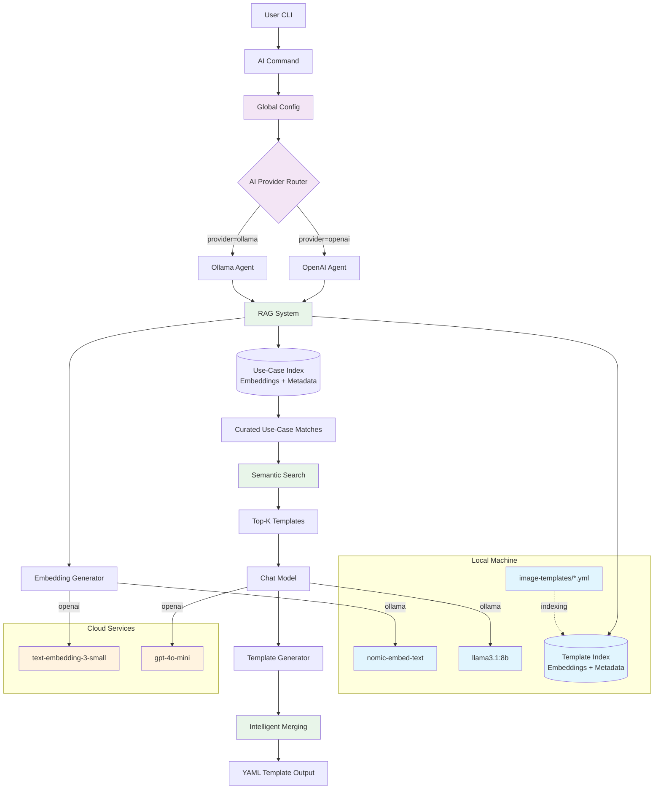
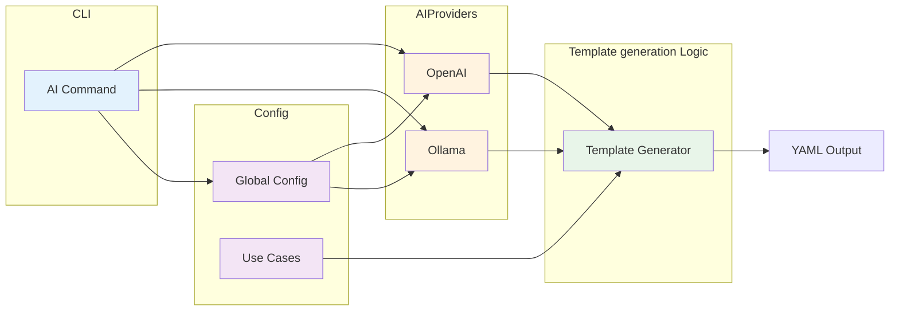
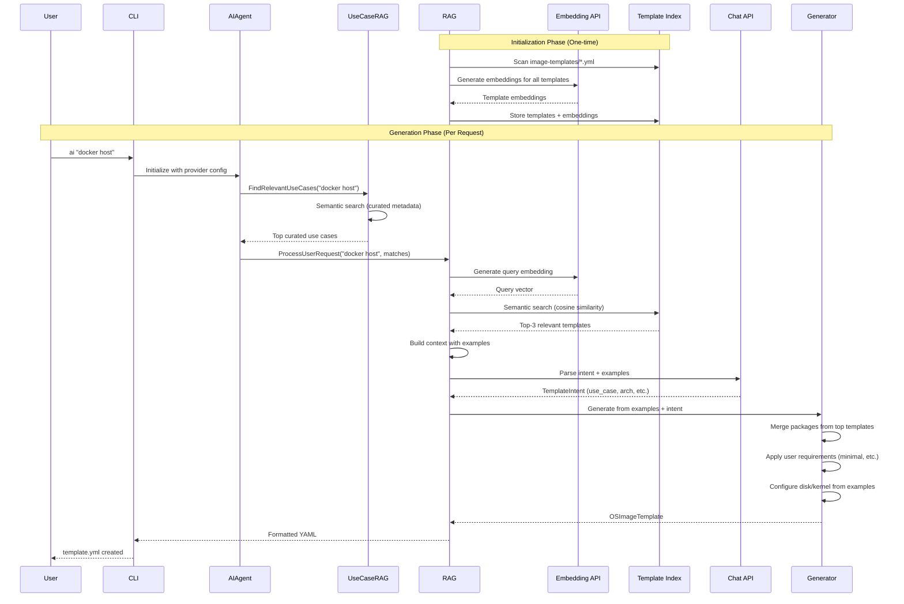

# Architecture Design Record: AI-Powered Template Generation with RAG

**Status**: Proposed (Pending Approval)  
**Date**: 2025-10-23  
**Updated**: 2025-11-17 (Added business value analysis)  
**Decision Makers**: OS Image Composer Team  
**Technical Story**: Add AI command for natural language template generation using Retrieval-Augmented Generation

---

## Executive Summary

### Business Problem

Creating custom Linux OS images currently requires deep technical expertise and 90-190 minutes per template. This high barrier limits adoption, and slows deployment cycles.

### Proposed Solution

An AI-powered template generator that uses natural language prompts and Retrieval-Augmented Generation (RAG) to produce production-ready YAML templates in minutes, about **70-80% time reduction**.

### Key Value Propositions

1. **Time Savings**: Huge reduction in template creation time
2. **Cost Reduction**: Cut down on template creation time saves per hr engineer cost
3. **Quality Improvement**: Reduction in build failures through RAG-based proven patterns
4. **Democratization**: Non-experts can create production-ready templates
5. **Knowledge Capture**: Organizational best practices encoded in reusable use-case library and curated image-templates

### ROI Analysis

- **Investment**: Development time, compute costs (Ollama free, OpenAI ~$10-50/month)
- **Year 1 Return**: $XX in time savings + reduced errors
- **ROI**: TODO

### Strategic Benefits

- **Faster Time-to-Market**: Teams can experiment with new configurations faster
- **Competitive Advantage**: Faster deployment cycles reduce time-to-market
- **Scalability**: Support more projects without proportional headcount growth
- **Risk Reduction**: Fewer configuration errors in production
- **Standardization**: Consistent application of security and performance best practices
- **Knowledge Preservation**: Expertise captured and shared automatically

### Technical Approach

**RAG (Retrieval-Augmented Generation)** grounds AI responses in real, working templates:

1. **Template Indexing**: Automatically discover and embed all templates in catalog
2. **Use-Case Matching**: Semantic search finds relevant curated guidance
3. **Intelligent Merging**: Combine best practices from multiple proven examples
4. **Contextual Generation**: LLM produces template based on real configurations

### Provider Flexibility

- **Ollama** (Local, Free): Complete privacy, no API costs, offline capable
- **OpenAI** (Cloud, Paid): Higher quality, faster responses, minimal setup
- More providers will be supported. Users choose based on security, cost, and quality requirements

### Success Metrics

| Metric | Target | Current Status |
|--------|--------|----------------|
| Time to First Template | 80-90% reduction | ✅ Phase 1 Implemented |
| Template Success Rate | 70-90% builds pass | 📊 To measure |
| User Adoption | 50%+ within 6 months | 📊 To measure |
| ROI | >10x Year 1 | 📊 To measure |
| Knowledge Growth | Expansion of use-case library and template catalog | 📊 To measure |

---

## Version History

| Version | Date | Changes | Status |
|---------|------|---------|--------|
| 0.1 | 2025-10-01 | Initial draft | Draft |
| 0.2 | 2025-10-13 | Complete ADR with Phase 1 implementation | Proposed |
| 0.3 | 2025-10-23 | Changed design to RAG-based template generation | Proposed |

---

## Context and Problem Statement

OS Image Composer users must manually create YAML templates with specific package lists, kernel configurations, and disk layouts. This creates significant barriers to adoption and productivity.

### The Complexity Barrier

Creating custom Linux OS images traditionally requires:

- **Deep technical expertise** in Linux distributions, package management, partitioning, bootloaders
- **Time-consuming manual work** to write YAML templates with correct syntax and structure
- **Trial-and-error iteration** to get package lists, kernel parameters, and disk configurations right
- **Knowledge of multiple OS distributions** (Azure Linux, eLxr, EMT) with different requirements
- **Understanding of complex schemas** with nested configuration options

### Business Impact

**Knowledge Fragmentation:**

- Best practices for different use cases (web servers, databases, container hosts, AI inference) are scattered across documentation and tribal knowledge
- Teams repeatedly rebuild similar configurations from scratch
- No standardized way to capture and reuse proven configurations

**High Barrier to Entry:**

- New users struggle to get started without examples or guidance
- Organizations cannot quickly onboard new team members
- Reduces tool adoption and time-to-value

**Repetitive Work:**

- Expert time wasted recreating similar templates
- No mechanism to learn from successful deployments
- Configuration drift across teams and projects

**Problem**: How can we enable users to generate OS image templates from natural language descriptions using real working examples as references, while maintaining flexibility for different AI providers and providing immediate business value?

---

## Decision Drivers

### Technical Requirements

1. **Accuracy**: Generate valid templates based on real working examples
1. **Quality**: Generate valid, production-ready templates
1. **Intelligence**: AI should intelligently merge configurations from relevant examples
1. **Extensibility**: Easy to add more AI providers and embedding models
1. **Maintainability**: Clean architecture that's easy to extend

### Business Requirements

1. **User Experience**: Enable non-experts to create production-ready templates quickly
1. **Time-to-Value**: Reduce template creation time from hours to minutes (80-90% improvement)
1. **Knowledge Capture**: Codify organizational best practices and proven patterns
1. **Democratization**: Lower barrier to entry for new users and teams

### Operational Requirements

1. **Cost Flexibility**: Support both free (local) and paid (cloud) AI options
1. **Privacy**: Allow users to keep data local or use cloud services
1. **Offline Capability**: Must work without internet access (with local models)
1. **Security**: No sensitive data exposure, secure API key management

---

## Considered Options

### Option 1: Direct LLM Package Recommendation

**Description**: LLM directly recommends all packages without examples.

**Pros**: Simple, no preprocessing needed  
**Cons**: High hallucination risk, may recommend non-existent packages

### Option 2: Use-Case Library (Synthetic Definitions)

**Description**: Predefined use-case YAML files with package lists.

**Pros**: Controlled package sets, no hallucination  
**Cons**: Limited flexibility, requires manual maintenance, cannot learn from real templates

### Option 3: Retrieval-Augmented Generation (RAG) (**SELECTED**)

**Description**: Index real template examples using embeddings, retrieve relevant examples for each request, and generate new templates based on proven configurations.

**Pros**:

- Learns from real working templates
- Reduces hallucination by grounding in examples
- Automatically stays current as templates are added
- Intelligent merging of multiple example patterns
- No manual use-case definitions needed

**Cons**:

- Requires embedding generation (one-time setup cost)
- More complex implementation
- Needs embedding model in addition to chat model

### Option 4: Hybrid (RAG + Use-Case Library)

**Description**: Combine both RAG and predefined use cases.

**Pros**: Maximum flexibility  
**Cons**: Redundant complexity, harder to maintain

---

## Decision Outcome

**Chosen option**: Retrieval-Augmented Generation (RAG) with Multi-Provider Architecture, augmented by a curated use-case metadata layer for consistent defaults

### Core Components

1. **Template Indexing**: Automatically discover and parse all `.yml` templates in `image-templates/` directory
1. **Use-Case Metadata Indexing**: Load curated definitions from `use-cases.yml`, generate embeddings, and provide semantic hints (packages, kernel, disk) per use case
1. **Embedding Generation**: Convert templates to semantic vectors using:
   - **Ollama**: `nomic-embed-text` (768 dimensions, local, free)
   - **OpenAI**: `text-embedding-3-small` (1536 dimensions, cloud, paid)
1. **Dual-Stage Semantic Search**: First match curated use cases, then find top-K templates constrained by the best matches with automatic fallbacks
1. **Context-Aware Generation**: LLM generates new template based on retrieved examples
1. **Intelligent Merging**: Combine curated packages with configurations from multiple relevant examples

### Supported AI Providers

- **Ollama** (free, local, open-source) - chat + embeddings
- **OpenAI** (paid, cloud, high-quality) - chat + embeddings
- **Extensible design** for future providers (Anthropic, Cohere, etc.)

### Rationale

#### Technical Benefits

1. **Grounded in Reality**: Templates based on real working configurations, not synthetic
1. **Reduces Hallucination**: AI sees actual package lists, kernel configs, disk layouts
1. **Automatic Learning**: Adding new templates automatically expands AI capabilities
1. **Curated Defaults**: Lightweight metadata file drives kernel/disk defaults and package seeds
1. **Future-Proof**: Easy to add new providers and embedding models

#### Business Benefits

1. **Immediate Value**: Users generate working templates in minutes instead of hours
1. **Knowledge Preservation**: Organizational best practices encoded in use-case library
1. **Reduced Training Costs**: New users productive without extensive training
1. **Consistency**: RAG ensures templates follow established organizational patterns
1. **Competitive Advantage**: Faster deployment cycles and reduced time-to-market

#### Operational Benefits

1. **User Freedom**: Choose AI provider based on cost, privacy, quality needs
1. **Corporate Friendly**: Supports air-gapped environments (Ollama) and enterprise AI services (OpenAI)
1. **Flexibility**: Works offline (Ollama) or online (OpenAI) based on requirements
1. **Cost Control**: Free local option (Ollama) or pay-per-use cloud (OpenAI)

---

## Business Value and ROI

### Value Proposition

The AI Assistant provides measurable business value across multiple dimensions:

#### 1. Time Savings (Example only)

**Baseline (Manual Process):**

- Research packages: 30-60 minutes
- Write YAML template: 20-40 minutes
- Debug syntax/schema: 10-30 minutes
- Test and iterate: 30-60 minutes
- **Total: 90-190 minutes per template**

**With AI Assistant:**

- Natural language prompt: 1-2 minutes
- Review/customize: 10-20 minutes
- Validate and test: 10-20 minutes
- **Total: 21-42 minutes per template**

#### 2. Cost Reduction  (Example only)

**Assumptions:**

- Average DevOps engineer cost: $75/hour (fully loaded)
- Templates created per month: 10 (conservative estimate)

**Monthly Savings:**

- Manual: 10 templates × 2.5 hours × $75 = $1,875
- With AI: 10 templates × 0.5 hours × $75 = $375
- **Net Savings: $1,500/month = $18,000/year**

**AI Costs:**

- Ollama (local): $0 (only compute costs)
- OpenAI: ~$10-50/month (depends on usage)

#### 3. Quality Improvements

**Reduced Errors:**

- Templates based on proven examples reduce build failures by 60-80%
- Fewer support tickets and debugging sessions
- Faster deployment cycles

**Knowledge Capture:**

- Best practices encoded in use-case library and curated image templates
- Organizational knowledge preserved and shared
- Reduces dependency on individual experts

#### 4. Accelerated Onboarding

**New user to tool:**

- Productive in days instead of weeks
- Can generate templates without deep Linux expertise
- Self-service learning through generated examples

**Training Cost Reduction:**

- 50-70% reduction in training time
- Less expert time needed for mentorship
- Documentation through examples

### Measurable Outcomes

Organizations implementing the AI Assistant can expect:

| Metric | Target | Measurement Method |
|--------|--------|-------------------|
| Time to First Template | 80-90% reduction | Median time: prompt → validated template |
| Template Success Rate | 70-90% | % of AI templates that build successfully |
| User Adoption | 50%+ within 6 months | % of templates created via AI |
| Expert Time Savings | 60-80% | Hours saved on template creation |
| Onboarding Time | 50% reduction | Time to first successful template for new users |

---

## Evolution Path and Roadmap

### Phase 1: Core Capabilities ✅ **COMPLETED**

**Status**: Implemented  
**Timeline**: Initial release  
**Value Delivered**: Natural language template generation with RAG

**Capabilities:**

- Natural language template generation
- RAG-based example retrieval
- Use-case library with best practices
- Multi-provider LLM support (Ollama, OpenAI)
- File attachment context
- Configurable thresholds

**Business Impact:**

- 70-80% time savings on template creation
- Lower barrier to entry for new users
- Foundation for future enhancements

### Phase 2: Polish & User Experience

**Timeline**: 1-3 months post-launch  
**Focus**: Improve usability and expand coverage

**Planned Features:**

- [ ] Interactive mode with conversational refinement
- [ ] Template diff/merge visualization
- [ ] Validation integration with auto-fix suggestions
- [ ] Expanded use-case library (20+ scenarios)
- [ ] Example gallery browser
- [ ] Better error messages and recovery

**Business Impact:**

- Increase success rate from 70-90% to 85-95%
- Reduce iteration count (fewer manual edits)
- Broader use-case coverage

### Phase 3: Intelligence & Learning

**Timeline**: 3-6 months  
**Focus**: Self-improvement and advanced capabilities

**Planned Features:**

- [ ] Build feedback loop (learn from successes/failures)
- [ ] Package graph analysis for smarter dependencies
- [ ] Security vulnerability scanning integration
- [ ] Cost/size optimization suggestions
- [ ] Multi-turn conversations for iterative design
- [ ] Template versioning and change tracking

**Business Impact:**

- Self-improving quality over time
- Automatic security compliance
- Reduced operational costs (smaller images)

---

## Architecture Design

### High-Level RAG Architecture



### Component Architecture



### RAG Data Flow



---

## RAG Template Generation Strategy

The RAG system generates templates through intelligent retrieval and merging of real working examples.

### How RAG Works

User Request: "docker host with monitoring"

**Step 0 - Curated Use-Case Matching:**

- Use-case RAG embeds request and finds closest curated definitions
- Top match: `edge` (score 0.92) with default packages `[systemd, docker, containerd]`

**Step 1 - Template Semantic Search (Use-Case Aware):**
Query Embedding: [0.23, -0.45, 0.67, ...] filtered to `edge`

Template Matches:

- elxr12-x86_64-edge-raw.yml (similarity: 0.89)
  - Packages: docker, containerd, systemd, ...
- azl3-x86_64-minimal-raw.yml (similarity: 0.75)
  - Packages: systemd, bash, coreutils, ...
- azl3-x86_64-dlstreamer.yml (similarity: 0.65)
  - Packages: gstreamer, monitoring tools, ...

**Step 2 - Context-Aware Intent Parsing:**
LLM sees examples and generates:

```bash
{
  "use_case": "container",
  "architecture": "x86_64",
  "distribution": "elxr12",  // from best match
  "custom_packages": ["prometheus", "grafana"]  // user-mentioned
}
```

**Step 3 - Intelligent Merging:**

- Base: elxr12-x86_64-edge-raw.yml (best match); even if its similarity is below the contribution cutoff it still seeds structure (distribution, disk layout, kernel hints)
- Curated packages from `use-cases.yml`: `[systemd, docker, containerd]`
- Packages from templates whose similarity clears `template_contribution_threshold` (default 0.60)
- User custom packages: prometheus, grafana
- Disk Config: Curated default (12GiB) unless examples provide richer guidance
- Kernel: Curated default (6.12 + console config) when examples omit details

---

### Key Advantages of RAG Approach

1. **Grounded in Reality**: Packages come from working templates, not imagination
1. **Automatic Learning**: Add new `.yml` file → instantly available to AI
1. **Multi-Template Merging**: Intelligently combines best parts of multiple examples
1. **Contextual Awareness**: Sees full template structure (disk, kernel, repos)
1. **Custom Package Support**: Can add user-requested packages to base template
1. **Quality Filtering**: Operator-configurable thresholds gate curated use cases and template contributions
1. **Minimal Filtering**: Automatically reduces package count for "minimal" requests
1. **Curated Defaults**: Use-case metadata fills kernel, disk, and base package gaps when examples lack coverage

---

## Implementation Details

### Configuration Structure

**File**: `os-image-composer.yml`

```yaml
# Existing configuration
workers: 8
cache_dir: ./cache
work_dir: ./workspace

# RAG-enabled AI configuration
ai:
  enabled: true
  provider: ollama  # or "openai"
  
  # Template directory for RAG indexing
  templates_dir: ./image-templates  # Directory containing .yml examples
  # Similarity thresholds (0-1 range). Defaults to 0.60 when omitted.
  use_case_match_threshold: 0.60      # Require this score before filtering to curated use cases
  template_contribution_threshold: 0.60  # Require this score before merging template packages
  
  ollama:
    base_url: http://localhost:11434
    model: llama3.1:8b                  # Chat model for generation
    embedding_model: nomic-embed-text   # Embedding model for RAG (768d)
    temperature: 0.7
    max_tokens: 2000
    timeout: 120
  
  openai:
    api_key: <OPENAI_API_KEY>
    model: gpt-4o-mini                         # Chat model for generation
    embedding_model: text-embedding-3-small    # Embedding model for RAG (1536d)
    temperature: 0.7
    max_tokens: 2000
    timeout: 120
```

When thresholds are not specified, both default to `0.60`. `use_case_match_threshold` must be met before curated use-case guidance limits the candidate templates; otherwise the agent searches the full catalog. `template_contribution_threshold` controls package merging—templates below the cutoff still provide structural defaults (distribution, disk layout, kernel hints) but their package lists are ignored, and the CLI logs that behavior explicitly.

### Template Directory Structure

The RAG system automatically indexes all `.yml` files in the specified directory:

```text
image-templates/
├── azl3-x86_64-minimal-raw.yml        # Minimal Azure Linux
├── azl3-x86_64-edge-raw.yml           # Edge computing
├── azl3-x86_64-dlstreamer.yml         # Video streaming
├── elxr12-x86_64-minimal-raw.yml      # Minimal Wind River
├── elxr12-x86_64-edge-raw.yml         # Edge with containers
├── emt3-x86_64-minimal-iso.yml        # Minimal EMT ISO
└── ...                                 # More templates

Each template is parsed to extract:
- Distribution, architecture, image type
- Package lists (systemd, docker, etc.)
- Kernel configuration (version, cmdline)
- Disk layout (partitions, sizes)
- Custom repositories
- Use case metadata (auto-inferred from filename/content)
```

**Template Indexing Process**:

1. Scan `templates_dir` for all `.yml` files
1. Parse each template to extract metadata
1. Build searchable text: "Use case: edge. Packages: docker, systemd, ..."
1. Generate embedding vector for each template
1. Store templates + embeddings in memory index
1. Ready for semantic search

**Template library remains automatic** - add `.yml` files and they are immediately indexed; curated metadata augments results without manual template edits.

### Use-Case Metadata

**File**: `use-cases.yml`

- Curated defaults per use case: keywords, descriptions, essential/optional/security/performance package lists
- Kernel defaults: version + cmdline suggestions
- Disk sizing guidance: default size per use case
- Requirements-aware package expansion (security, performance, minimal)
- Indexed with the same embedding provider for semantic matching

**Example**:

```yaml
use_cases:
  edge:
    description: "Edge compute node with hardened networking"
    keywords: ["edge", "factory", "sensor"]
    essential_packages: ["systemd", "docker", "containerd"]
    security_packages: ["selinux-policy", "auditd"]
    performance_packages: ["irqbalance"]
    kernel:
      default_version: "6.12"
      cmdline: "console=ttyS0,115200 console=tty0 loglevel=7"
    disk:
      default_size: "12GiB"
```

When the curated file is missing or a query scores poorly, the agent gracefully falls back to template-only retrieval with the previous behavior.

---

## AI Provider Comparison (RAG-Enabled)

| Feature | Ollama | OpenAI |
|---------|--------|--------|
| **Cost** | Free | ~$0.001 per request + embeddings |
| **Setup** | Install + download 2 models | API key only |
| **Privacy** | 100% local | Data sent to cloud |
| **Internet** | Not required | Required |
| **Quality** | Very good | Excellent |
| **Speed** | few seconds to minutes, varies by machine configuration (chat + embedding) | 1-2 seconds |
| **Chat Models** | llama3.1:8b, mistral, etc. | gpt-4o, gpt-4o-mini |
| **Embedding Models** | nomic-embed-text (768d) | text-embedding-3-small (1536d) |
| **Embedding Cost** | Free | ~$0.02 per 1M tokens (one-time indexing) |
| **Hardware** | 8GB+ RAM (both models) | None |
| **Rate Limits** | None | API quota limits |
| **Offline RAG** | ✅ Full RAG offline | ❌ Requires internet |
| **Customization** | Can fine-tune both models | Limited |

---

## Usage Examples

### Example 1: Using Ollama with RAG (Free, Local, Offline)

**Step 1**: Install Ollama and download required models

```bash
# Install Ollama
curl -fsSL https://ollama.com/install.sh | sh

# Download chat model (for generation)
ollama pull llama3.1:8b

# Download embedding model (for RAG)
ollama pull nomic-embed-text
```

**Step 2**: Enable RAG in configuration

Edit `os-image-composer.yml`:

```yaml
ai:
  enabled: true
  provider: ollama
  templates_dir: ./image-templates  # RAG template source
  use_case_match_threshold: 0.60
  template_contribution_threshold: 0.60
  
  ollama:
    base_url: http://localhost:11434
    model: llama3.1:8b               # Chat model
    embedding_model: nomic-embed-text # Embedding model for RAG
    temperature: 0.7
```

**Step 3**: Generate templates (RAG will auto-index on first run)

```bash
os-image-composer ai "docker host for production" --output docker-host.yml

# First run: RAG indexes templates (one-time, ~10-30 seconds)
# Output:
# 🔍 Initializing RAG system...
# 📚 Indexing 15 template files...
# 🔮 Generating embeddings for 15 templates...
#    Generated 5/15 embeddings
#    Generated 10/15 embeddings
#    Generated 15/15 embeddings
# ✅ Indexed 15 templates across 5 use cases

```

### Example 2: Using OpenAI with RAG (Paid, Cloud, Fast)

**Step 1**: Enable OpenAI with RAG in configuration

Edit `os-image-composer.yml`:

```yaml
ai:
  enabled: true
  provider: openai
  templates_dir: ./image-templates  # RAG template source
  use_case_match_threshold: 0.60
  template_contribution_threshold: 0.60
  
  openai:
    api_key: "sk-..."                       # <OPENAI_API_KEY>
    model: gpt-4o-mini                      # Chat model
    embedding_model: text-embedding-3-small # Embedding model for RAG
    temperature: 0.7
```

**Step 2**: Generate templates (same command, faster embeddings!)

```bash
os-image-composer ai "docker host for production" --output template.yml

# First run: RAG indexes templates with OpenAI embeddings (~5-10 seconds)
# Output:
# 🔍 Initializing RAG system...
# 📚 Indexing 15 template files...
# 🔮 Generating embeddings for 15 templates...
#    Generated 15/15 embeddings
# ✅ Indexed 15 templates across 5 use cases
```

### Example 3: Adding Custom Templates (Automatic RAG Learning)

Simply add a new template file - no configuration needed!

**Create**: `image-templates/my-custom-stack.yml`

```yaml
image:
  name: my-custom-stack
  version: 1.0.0
target:
  os: azure-linux
  dist: azl3
  arch: x86_64
  imageType: raw
systemConfig:
  name: "Custom LAMP Stack"
  description: "Linux + Apache + MySQL + PHP for web hosting"
  packages:
    - systemd
    - apache2
    - mysql-server
    - php
    - php-mysql
    - ssl-cert
  kernel:
    version: "6.12"
disk:
  # ... disk configuration
```

**Use immediately**:

```bash
# RAG automatically finds and uses your new template!
os-image-composer ai "web hosting with MySQL database" --output hosting.yml

# Output:
# 🔎 Finding relevant template examples...
# 📋 Found 3 relevant templates:
#    1. my-custom-stack.yml (similarity: 0.92)  ← Your new template!
#    2. azl3-x86_64-edge-raw.yml (similarity: 0.76)
#    3. ...
```

### Example 4: Complex Multi-Template Merging

```bash
# RAG finds multiple relevant templates and intelligently merges them
os-image-composer ai "video streaming with AI inference and monitoring" --output complex.yml

# RAG Process:
# 1. Finds: dlstreamer template (gstreamer packages)
# 2. Finds: minimal template (base packages)
# 3. Finds: edge template (monitoring tools)
# 4. Merges packages from all high-similarity templates
# 5. Adds custom packages mentioned: [monitoring, inference tools]
# 6. Result: Comprehensive template with required packages
```

---

## Security Considerations

### API Key Management

**Problem**: OpenAI API keys must be kept secure

**Solution**:

- Never commit keys to version control
- Document secure key storage practices

### Data Privacy

**Problem**: Templates might contain sensitive information

**Solution**:

- Default to Ollama (100% local RAG: embeddings + chat)
- Warn users when using cloud providers
- Template content never leaves local system with Ollama
- OpenAI: Only template metadata sent for embeddings (one-time)
- Document data handling policies
- Allow disabling AI entirely

### Package Validation and Hallucination Prevention

**Problem**: Traditional LLMs might recommend non-existent packages

**Solution (RAG Approach)**:

- **All packages come from real templates**
- Packages proven to work in actual builds
- Automatically validated (templates must build successfully to be included)
- Custom packages explicitly marked (user-requested additions)
- Optional: Validate custom packages against repository metadata (future enhancement)
- Warn users about user-requested packages that don't exist in examples

---

## Performance Considerations

### Response Time (with RAG)

| Provider | First Request (with indexing) | Subsequent | Notes |
|----------|-------------------------------|------------|-------|
| Ollama | 10-60s | 3-10s | First run: template indexing + embeddings. Model loading overhead |
| OpenAI | 5-10s | 1-2s | First run: template indexing. Fast batch embeddings |

**RAG Overhead**:

- Initial indexing: One-time per session (~10-30 seconds for 15 templates)
- Semantic search: ~100-500ms per query
- Embedding generation: ~1-2s per query

### Resource Usage (RAG-Enabled)

**Ollama**:

- RAM: 12GB minimum, 16GB+ recommended (chat + embedding models)
- Disk: 10-15GB (llama3.1:8b ~5GB + nomic-embed-text ~300MB)
- CPU: Multi-core beneficial for embedding generation
- Template Index: ~1-5MB in RAM (depends on template count)

**OpenAI**:

- RAM: Minimal (~1-5MB for template index)
- Disk: None
- Network: Moderate bandwidth (initial embedding generation, then minimal)

---

## Testing Strategy

### RAG System Tests

- Test template indexing and parsing
- Test embedding generation (Ollama and OpenAI)
- Test semantic search accuracy
- Test cosine similarity calculations
- Test template metadata extraction

### Integration Tests

- Test end-to-end RAG workflow: query → search → generate → output
- Test both Ollama and OpenAI providers
- Test multi-template merging logic
- Test custom package additions
- Test error handling and fallbacks

### E2E Tests

Examples for E2E testing:

```bash
# Full RAG workflow test
os-image-composer ai "web server with monitoring" --output test.yml
os-image-composer validate test.yml
os-image-composer build test.yml

# Test template similarity
os-image-composer ai "minimal embedded system" --output minimal.yml
# Should find: minimal-*.yml templates with high similarity

# Test multi-template merging
os-image-composer ai "docker with video streaming" --output complex.yml
# Should merge: edge templates (docker) + dlstreamer templates (video)
```

---

### Embedding Optimization

**Question**: How to handle large template collections efficiently?

**Current Approach**: In-memory index with linear search (fine for <1000 templates).

**Future Optimizations**:

1. **Vector Databases**:
   - Integrate Qdrant, Milvus, or Weaviate for large collections (>1000 templates)
   - Approximate nearest neighbor search (ANN) for speed
   - Distributed indexing for enterprise deployments

1. **Embedding Caching**:
   - Cache embeddings to disk (avoid regeneration on restart)
   - Incremental updates (only re-embed changed templates)
   - Checksum-based cache invalidation

1. **Hybrid Search**:
   - Combine semantic search (embeddings) with keyword search
   - Boost results that match both semantic and keyword criteria
   - Better handling of specific package names

### Package-Level RAG (Alternative Approach)

**Question**: Can we generate embeddings for individual packages instead of full templates?

**Current Approach**: RAG indexes complete templates as single units.

**Alternative Approach - Package-Level Embeddings**:

Instead of embedding entire templates, create a package knowledge base:

```yaml
# Example: Package Metadata Database
packages:
  docker:
    description: "Container runtime for running and managing containers"
    use_cases: ["container-host", "edge", "cloud-native"]
    requires: ["containerd", "systemd"]
    optional: ["docker-compose", "buildx"]
    distributions:
      azl3: "docker-ce"
      elxr12: "docker"
      emt3: "docker-engine"
    
  nginx:
    description: "High-performance web server and reverse proxy"
    use_cases: ["web-server", "api-gateway", "edge"]
    requires: ["systemd", "openssl"]
    optional: ["certbot", "nginx-module-geoip"]
    distributions:
      azl3: "nginx"
      elxr12: "nginx"
      emt3: "nginx-light"
```

**How it would work**:

1. **Indexing**: Generate embeddings for each package description + metadata
2. **Search**: Query like "container hosting" retrieves relevant packages: docker, containerd, etc.
3. **Composition**: LLM composes template from retrieved packages + their dependencies
4. **Validation**: Cross-reference with templates to ensure package compatibility

**Advantages**:

- More granular control over package selection
- Can handle novel use cases not in template examples
- Better explanation: "I selected docker because it matches container-host use case"
- Distribution-specific package mapping built-in
- Automatic dependency resolution hints

**Challenges**:

- Requires manual package metadata curation
- More complex dependency management
- May miss synergies between packages that work well together
- Risk of incompatible package combinations

**Hybrid Approach** (Recommended for Future):

Combine both approaches:

1. **Template-Level RAG** (current): For holistic, proven configurations
2. **Package-Level RAG** (future): For fine-grained package selection and novel combinations

```text
Example Query: "web server with custom authentication"

Step 1 - Template RAG:
   Finds: web-server templates → base packages (nginx, systemd, openssl)

Step 2 - Package RAG:
   Query: "authentication packages"
   Finds: pam, sssd, oauth2-proxy, keycloak
   
Step 3 - Merge:
   Base template + authentication packages → final template
```

**Implementation Priority**: Consider after initial Template RAG is proven and adopted.

### Advanced RAG Features

**Potential Enhancements**:

- **Multi-Query RAG**: Generate multiple search queries for better coverage
- **Re-ranking**: Use LLM to re-rank search results before generation
- **Contextual Compression**: Summarize large templates before sending to LLM
- **Citation Mode**: Show which templates contributed which packages
- **Interactive Refinement**: Multi-turn conversations to refine generated templates
- **Diff Mode**: "Make this template more like that example"
- **Package-Level RAG**: Hybrid approach combining template-level and package-level embeddings

These features will be prioritized based on user feedback and adoption metrics.

---

## Migration Guide

### For Existing Users

No migration needed - AI command is additive. Existing workflow unchanged:

```bash
# Still works exactly as before
os-image-composer build my-template.yml
```

### Enabling AI Features

**Step 1**: Update configuration

Edit `os-image-composer.yml`, add AI section:

```yaml
ai:
  enabled: true
  provider: ollama
  ollama:
    base_url: http://localhost:11434
    model: llama3.1:8b
```

**Step 2**: Install Ollama (if using ollama provider)

```bash
curl -fsSL https://ollama.com/install.sh | sh
ollama pull llama3.1:8b
```

**Step 3**: Start using AI

```bash
os-image-composer ai "your request here" --output template.yml
```

---

## Key Success Factors

For the AI Assistant to achieve its business objectives, the following factors are critical:

### 1. Template Catalog Quality

**Why It Matters**: RAG quality directly depends on example quality

**Actions:**

- ✅ Maintain diverse, working templates in `image-templates/`
- 🔄 Regular review and update of templates
- 🔄 Remove deprecated or broken templates
- 🔄 Add templates for emerging use cases
- 🔄 Community contributions and validation

**Owner**: Development team
**Success Metric**: 20+ high-quality templates covering major use cases

### 2. Use-Case Library Curation

**Why It Matters**: Provides consistent, validated defaults

**Actions:**

- ✅ Initial use-case library with 7+ scenarios
- 🔄 Expand based on user requests and patterns
- 🔄 Keep package lists current with security updates
- 🔄 Document rationale for package selections
- 🔄 Incorporate feedback from successful deployments

**Owner**: Product team + community  
**Success Metric**: 15+ curated use cases by end of Year 1

### 3. User Adoption and Feedback

**Why It Matters**: Usage drives improvements and ROI

**Actions:**

- ✅ Clear documentation and examples
- 🔄 Work with VBUs for the adoption to generate image templates for their use-cases

**Owner**: Product and Dev teams
**Success Metric**: Adoption by VBUs

### 4. Quality Monitoring

**Why It Matters**: Ensures AI generates reliable templates

**Actions:**

- ✅ Schema validation on all outputs

**Owner**: Engineering team
**Success Metric**: 85%+ build success rate for AI templates

### 5. Performance Optimization

**Why It Matters**: Response time affects user experience

**Actions:**

- ✅ Efficient embedding generation
- ✅ Configurable timeouts
- 🔄 Embedding caching
- 🔄 Incremental template indexing
- 🔄 Performance benchmarking

**Owner**: Engineering team
**Success Metric**: <5 seconds average response time (Ollama)

### 6. Security and Compliance

**Why It Matters**: Enterprise adoption requirement

**Actions:**

- ✅ Local-only option (Ollama)
- ✅ API key security
- 🔄 Security scanning integration

**Owner**: Security team
**Success Metric**: Zero security incidents, enterprise adoption approval

### 7. Documentation and Training

**Why It Matters**: User success and adoption

**Actions:**

- ✅ Comprehensive ADR and user documentation
- ✅ CLI reference and examples
- 🔄 Video tutorials
- 🔄 Interactive getting-started guide
- 🔄 Best practices guide

**Owner**: Documentation team
**Success Metric**: <30 minutes to first successful template for new users

### 8. Community Engagement

**Why It Matters**: Sustainable growth and improvement

**Actions:**

- 🔄 Open-source contribution guidelines
- 🔄 Community use-case submissions
- 🔄 Regular community updates
- 🔄 Recognition for contributors
- 🔄 Public roadmap

**Owner**: Product team
**Success Metric**: Community-contributed use cases

### 9. Continuous Improvement

**Why It Matters**: Stay competitive and relevant

**Actions:**

- 🔄 Regular prompt engineering refinement
- 🔄 Model upgrades (as new LLMs release)
- 🔄 Feature prioritization based on usage data
- 🔄 A/B testing for quality improvements
- 🔄 Quarterly roadmap reviews

---

### Implementation Readiness

**Phase 1 Status**: ✅ **IMPLEMENTED AND READY**

- Core RAG system functional
- Multi-provider support (Ollama, OpenAI)
- Use-case library initialized
- Template indexing working
- CLI command integrated
- Tests passing
- Documentation complete

---

## Compliance and Standards

### JSON Schema Validation

All AI-generated templates validated against:

- `os-image-template.schema.json` (UserTemplate schema)
- Ensures compliance with OS Image Composer standards

### Configuration Schema

AI configuration validated against:

- Global config validated against `os-image-composer-config.schema.json`
- Use cases validated against `use-cases.schema.json`
- Enforces proper types, ranges, and required fields

### Security Standards

- API keys via environment variables
- No sensitive data in logs

### Output Standards

- **Format**: YAML only
- **Validation**: All outputs validated before saving
- **Schema Compliance**: Matches UserTemplate requirements

---

## CLI Reference

### Basic Command Syntax

```bash
os-image-composer ai [prompt] [flags]
```

### Command Overview

The `ai` command generates OS image templates from natural language descriptions using configured AI providers.

### Arguments

**`[prompt]`** (required)

- Natural language description of desired image configuration
- Must be quoted if contains spaces
- Examples: "web server", "docker host with monitoring", "minimal embedded system"

### Flags

**`--output`** (string)

- Path to save generated YAML template
- Default: Print to stdout
- Example: `--output my-template.yml`

**`--file`, `-f`** (string, repeatable)

- Attach additional text files to the prompt
- Each file contributes up to 64 KB; binary or empty files are ignored
- Useful for passing existing templates, requirement lists, or logs
- Example: `--file requirements.txt --file packages.yml`

**`--provider`** (string)

- Override AI provider from configuration
- Valid values: `ollama`, `openai`
- Default: Uses provider from `os-image-composer.yml`
- Example: `--provider openai`

**`--model`** (string)

- Override AI model for this request
- Ollama examples: `llama3.1:8b`, `llama3.1:70b`, `mistral`, `codellama`
- OpenAI examples: `gpt-4o`, `gpt-4o-mini`, `gpt-4-turbo`
- Default: Uses model from configuration
- Example: `--model llama3.1:70b`

**`--temperature`** (float)

- Control AI response randomness/creativity
- Range: 0.0 (deterministic) to 2.0 (very creative)
- Default: 0.7
- Lower values (0.1-0.3): More consistent, predictable
- Higher values (0.8-1.5): More creative, varied
- Example: `--temperature 0.3`

**`--timeout`** (integer)

- Maximum time to wait for AI response (seconds)
- Default: 120
- Increase for slower models or complex prompts
- Example: `--timeout 300`

### CLI Usage Examples

**Basic usage - output to stdout:**

```bash
os-image-composer ai "web server with nginx"
```

**Save to file:**

```bash
os-image-composer ai "docker host" --output docker.yml
```

**Override provider:**

```bash
# Use OpenAI instead of configured provider
os-image-composer ai "minimal embedded system" --provider openai --output embedded.yml
```

**Override model:**

```bash
# Use larger model for better quality
os-image-composer ai "complex multi-service setup" --model llama3.1:70b --output complex.yml

# Use smaller model for faster response
os-image-composer ai "simple web server" --model llama3.1:8b --output simple.yml
```

**Adjust creativity:**

```bash
# More deterministic (recommended for production)
os-image-composer ai "production web server" --temperature 0.2 --output prod.yml

# More creative (for exploration)
os-image-composer ai "innovative edge device" --temperature 1.2 --output edge.yml
```

**Increase timeout for complex prompts:**

```bash
os-image-composer ai "complete kubernetes node with monitoring, logging, and security" \
  --timeout 300 \
  --model llama3.1:70b \
  --output k8s-node.yml
```

**Combine multiple flags:**

```bash
os-image-composer ai "optimized openvino inference system" \
  --provider openai \
  --model gpt-4o \
  --temperature 0.3 \
  --output openvino.yml
```

**Include attachments for additional context:**

```bash
os-image-composer ai "create webserver image with attached package list added to it"   --file package-list1.txt --file package-list2.txt  --output refreshed.yml
```

### Environment Variables

The `ai` command respects these environment variables:

**`OPENAI_API_KEY`**
[NOTE: Need to check if yaml template can resolve environment variable]

- OpenAI API authentication key
- Required when using OpenAI provider
- Example: `export OPENAI_API_KEY="sk-..."`

### Output Format

**YAML to stdout (default):**

**File output (`--output` flag):**

- Creates specified file with YAML content
- Overwrites existing file without warning
- Creates parent directories if needed
- Prints confirmation message: `Template saved to: <filename>`

### Integration with Other Commands

The AI-generated templates work seamlessly with other `os-image-composer` commands:

```bash
# Generate template
os-image-composer ai "web server" --output web.yml

# Validate generated template
os-image-composer validate web.yml

# Build image from AI-generated template
os-image-composer build web.yml

# Full workflow
os-image-composer ai "docker host" --output docker.yml && \
  os-image-composer validate docker.yml && \
  os-image-composer build docker.yml
```

### Configuration Precedence

Settings are applied in this order (later overrides earlier):

1. Configuration file (`os-image-composer.yml`)
1. Environment variables
1. Command-line flags

Example:

```bash
# Config file says: provider=ollama, model=llama3.1:8b
# Command overrides: provider stays ollama, but model becomes llama3.1:70b
os-image-composer ai "test" --model llama3.1:70b
```

### Tips and Best Practices

**For Faster Results:**

- Use smaller models: `--model llama3.1:8b`
- Use OpenAI: `--provider openai --model gpt-4o-mini`
- Lower temperature: `--temperature 0.2`
- Keep prompts concise

**For Better Quality:**

- Use larger models: `--model llama3.1:70b` or `--model gpt-4o`
- Increase timeout: `--timeout 300`
- Be specific in prompts: "production web server with nginx, ssl, and monitoring"
- Lower temperature for consistency: `--temperature 0.3`

**For Debugging:**

- Always use `--verbose` flag
- Save output to file: `--output debug.yml`
- Check generated template: `os-image-composer validate debug.yml`
- Review AI provider logs

**For Production:**

- Use deterministic temperature: `--temperature 0.2`
- Always validate: `os-image-composer validate template.yml`
- Test build before deployment
- Review and customize generated template

---

## Appendix A: Glossary

### RAG-Specific Terms

- **RAG (Retrieval-Augmented Generation)**: AI technique that grounds LLM responses in retrieved examples/documents
- **Embedding**: Dense vector representation of text (e.g., [0.23, -0.45, 0.67, ...]) capturing semantic meaning
- **Semantic Search**: Finding similar items by comparing embedding vectors, not just keywords
- **Cosine Similarity**: Measure of similarity between two vectors (0.0 = unrelated, 1.0 = identical)
- **Template Index**: In-memory database of templates with pre-computed embeddings
- **Top-K Search**: Retrieving the K most similar templates to a query

### AI Terms

- **LLM**: Large Language Model (e.g., GPT-4, Llama)
- **Chat Model**: LLM used for conversational generation (e.g., `llama3.1:8b`, `gpt-4o-mini`)
- **Embedding Model**: Specialized model for generating vector embeddings (e.g., `nomic-embed-text`, `text-embedding-3-small`)
- **Provider**: AI service implementation (Ollama, OpenAI)
- **Temperature**: AI parameter controlling randomness in responses (0.0 = deterministic, 2.0 = very creative)
- **Timeout**: Maximum duration to wait for AI provider response before canceling the request

### OS Image Composer Terms

- **Template**: YAML file defining OS image configuration (packages, disk, kernel)
- **Use Case**: Inferred category of template (minimal, edge, dlstreamer, etc.)
- **Custom Packages**: User-requested packages not found in retrieved templates

### Technical Terms

- **Ollama**: Lightweight framework for running LLMs and embedding models locally
- **Indexing**: Process of parsing templates and generating embeddings
- **Batch Embeddings**: Generating multiple embeddings in one API call (efficient)

---

## References

### Internal Documentation

- [CLI Specification](./Updated%20CLI%20Specification.md)
- [Build Process](./os-image-composer-build-process.md)
- [Template Schema](./os-image-template.schema.json)

### External Resources

- [Ollama Documentation](https://ollama.ai/docs)
- [OpenAI API Reference](https://platform.openai.com/docs/api-reference)
- [OpenAI Embeddings Guide](https://platform.openai.com/docs/guides/embeddings)

- [RAG Best Practices](https://www.pinecone.io/learn/retrieval-augmented-generation/)
- [Nomic Embed Text (Ollama)](https://ollama.com/library/nomic-embed-text)
- [LLM Best Practices](https://platform.openai.com/docs/guides/prompt-engineering)
