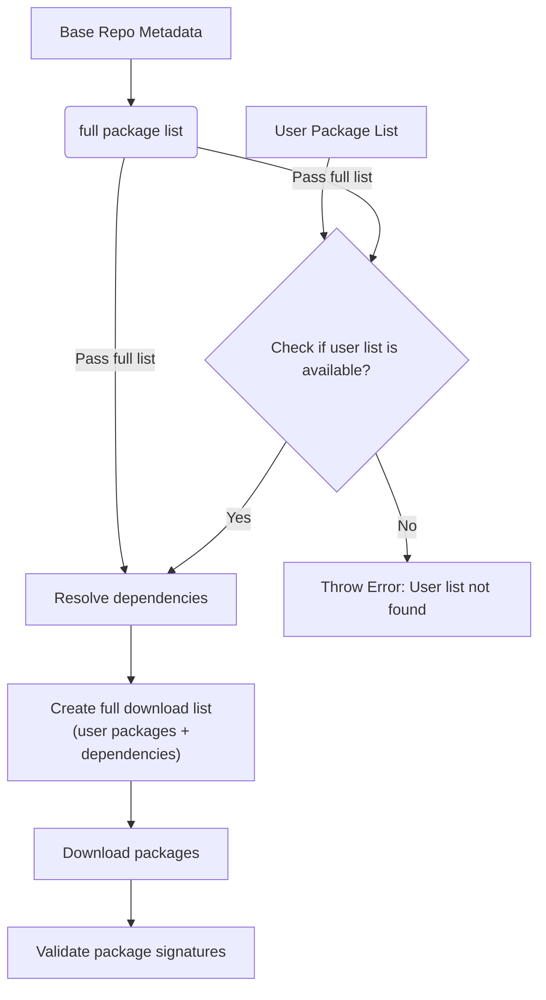
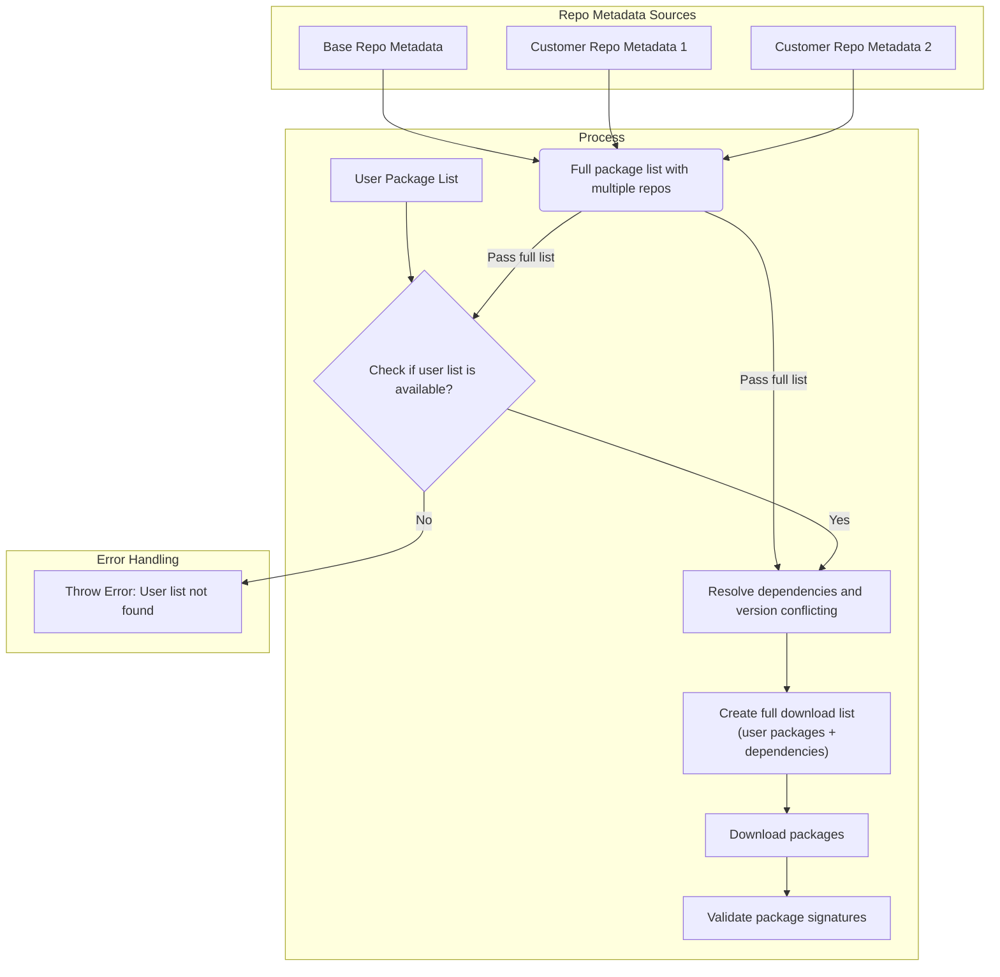

# Multiple Package Repo Support

A major feature of the OS Image Composer tool is its ability to let you add
multiple package repositories to the OS build. These repositories often contain
in-house proprietary packages or upstream packages pending integration. By
supporting multiple repositories, the tool enables rapid deployment,
experimentation, and validation of custom software alongside standard OS
components. This document describes the key aspects of the multiple package repo:

- **Configuration**: Describes how to add and configure extra package
  repositories, enabling the OS Image Composer tool to access and pull custom
  packages that are unavailable in the base repository.
- **Package conflict priority consideration**: Outlines how the tool determines
  which package to use when duplicates exist across repositories using
  per-repository `priority`.
- **Allow-list support**: Describes `allowPackages` (white list) to restrict
  which packages are indexed from a repository.
- **Architectural design**: Describes how the design extends the tool's package
  and dependency pre-download framework to resolve dependencies without relying
  on package managers like APT or
  [tdnf](https://github.com/vmware/tdnf).

## Table of Contents

- [Setting Multiple Repositories in the User Template](#setting-multiple-repositories-in-the-user-template)
- [Package Conflict Priority Consideration](#package-conflict-priority-consideration)
  - [Priority Rules](#priority-rules)
  - [Resolution Process](#resolution-process)
  - [Conflict Resolution Examples](#conflict-resolution-examples)
    - [Example 1: Different versions across repositories](#example-1-different-versions-across-repositories)
    - [Example 2: Same version in multiple repositories](#example-2-same-version-in-multiple-repositories)
    - [Example 3: Mixed scenario](#example-3-mixed-scenario)
  - [Dependencies Package](#dependencies-package)
    - [Dependency Resolution in a Multi-Repository Environment](#dependency-resolution-in-a-multi-repository-environment)
    - [Dependency Resolution Rules](#dependency-resolution-rules)
    - [Dependency Resolution Examples](#dependency-resolution-examples)
      - [Example 1: Parent package with dependencies](#example-1-parent-package-with-dependencies)
      - [Example 2: Transitive dependencies](#example-2-transitive-dependencies)
      - [Example 3: Fallback to base repository](#example-3-fallback-to-base-repository)
      - [Example 4: Unresolvable dependency](#example-4-unresolvable-dependency)
      - [Example 5: Conflicting dependency versions](#example-5-conflicting-dependency-versions)
    - [Benefits of Repository Affinity](#benefits-of-repository-affinity)
- [AllowPackages White List](#allowpackages-white-list)
- [Architectural Design](#architectural-design)
  - [Single Repository Support](#single-repository-support)
  - [Multiple Repositories Support](#multiple-repositories-support)
  - [Multiple Repository Flow](#multiple-repository-flow)
- [Related Documentation](#related-documentation)

## Setting Multiple Repositories in the User Template

You can specify additional package repositories in the OS Image Composer user
template. Here's an example:

```yaml
packageRepositories:
  - codename: "repoA"
    url: "https://repo.example.com/os/base"
    pkey: "https://repo.example.com/keys/RPM-GPG-KEY"
    priority: 1001
    allowPackages:
      - kernel-6.17.11
      - kernel-drivers-gpu-6.17.11
      - libva*
      - wayland*

  - codename: "repoB"
    url: "https://repo2.example.com/os/extra"
    pkey: "https://repo2.example.com/keys/RPM-GPG-KEY"
    priority: 500

systemConfig:
  packages:
    - kernel-6.17.11
    - libva-utils
    - my-custom-package
```

Each repository must follow the standard Debian or RPM structure, including all
required metadata. The OS Image Composer tool performs sanity checks to ensure
repository URLs are valid before proceeding. See the following repository
setup references:

- Debian repo setup: https://wiki.debian.org/DebianRepository/Setup
- RPM repo setup: https://wiki.centos.org/HowTos/CreateLocalRepos

## Package Conflict Priority Consideration

When multiple repositories contain packages with the same name, the OS Image
Composer tool uses repository `priority` to select candidates.

### Priority Rules

The OS Image Composer tool follows these rules:

1. **Higher numeric priority wins**: repositories with higher `priority`
  values are preferred.
2. **Version tie-breaker**: when candidates are in the same priority class,
  the resolver picks the most suitable version (usually the newest one that
  satisfies constraints).
3. **Repository affinity for dependencies**: when possible, dependencies are
  chosen from the same repository family as the parent package.

Debian resolver supports additional APT-like priority behavior:

- `priority < 0`: block packages from that repository
- `priority = 990`: prefer over default repos
- `priority = 1000`: install even if version is lower
- `priority > 1000`: force preference

### Resolution Process

Decision Flow:

1. Gather all matching candidates across configured repositories.
2. Apply repository `priority` rules.
3. Apply version constraints from dependency metadata.
4. Select candidate with best priority/constraint fit; use repository affinity
  for transitive dependencies when available.

### Conflict Resolution Examples

#### Example 1: Different versions across repositories

- repoA (`priority: 1001`) contains: `curl-7.68.0`
- repoB (`priority: 500`) contains: `curl-8.0.1`
- **Result**: repoA candidate is preferred because repository priority is
  higher.

#### Example 2: Same version in multiple repositories

- repoA (`priority: 900`) contains: `mypackage-1.0.0`
- repoB (`priority: 900`) contains: `mypackage-1.0.0`
- **Result**: resolver uses tie-breakers (version/equivalent candidate and
  repository affinity when resolving dependencies).

#### Example 3: Mixed scenario

- repoA (`priority: -1`) contains: `testpackage-2.0.0`
- repoB (`priority: 500`) contains: `testpackage-1.5.0`
- **Result**: repoA package is blocked due to negative priority; repoB package
  is selected.

These priority semantics provide explicit control for pinning, preference, and
blocking behavior in multi-repo builds.

## AllowPackages White List

`allowPackages` is an optional per-repository white list in
`packageRepositories`.

- If omitted or empty, all packages from that repository metadata are eligible.
- If provided, only matching package names are indexed from that repository.
- Matching supports:
  - exact names (for example `spice-server`)
  - prefix/version pin patterns (for example `kernel-6.17.11`)
  - glob patterns (for example `libva*`, `wayland*`)

This filtering happens during repository metadata parsing, before package
matching and dependency resolution. It is useful for tightening repository
scope and reducing accidental package selection.

### Dependencies Package

What are Dependencies? In simple terms, dependencies are other packages that a
software package needs to work properly. Think of it like cooking a recipe:
If you want to make a cake, you need ingredients like flour, eggs, and sugar.
Similarly, when you install a software package, it often needs other software
packages (dependencies) to function correctly.

Here are several examples: A web browser might depend on graphics libraries to
display images; a media player might depend on codec packages to play different
video formats; a database application might depend on networking libraries to
communicate over the internet.

#### Dependency Resolution in a Multi-Repository Environment

The OS Image Composer tool automatically resolves dependencies according to the
rules below, ensuring package consistency by keeping parent packages and their
dependencies from the same repository.

#### Dependency Resolution Rules

1. **Repository Affinity**: Dependencies are always pulled from the same
   repository as their parent package, regardless of newer versions available
   in other repositories.

2. **Fallback to Base Repository**: If a dependency cannot be resolved within
   the same repository as the parent package (i.e., it was not found at all),
   the tool will attempt to resolve the dependency from the base OS repository.

3. **Conflict Prevention**: This approach prevents version mismatches and
   compatibility issues that could arise from mixing dependencies across
   different repositories.

4. **Single Version Enforcement**: If different packages require different
   versions of the same dependency (e.g., package A needs `libtest=0.1` and
   package B needs `libtest=0.2`), the tool will fail with an error. Multiple
   versions of the same dependency cannot be installed in parallel.

#### Dependency Resolution Examples

##### Example 1: Parent package with dependencies

- User specifies: `myapp-2.0.0` (available in intel1 repo)
- `myapp-2.0.0` depends on: `libssl-1.1.0` and `libcrypto-1.1.0`
- Base repo contains: `libssl-1.2.0` (newer version)
- intel1 repo contains: `libssl-1.1.0` and `libcrypto-1.1.0`
- **Result**: The tool pulls `libssl-1.1.0` and `libcrypto-1.1.0` from intel1
  repo (same as parent).

##### Example 2: Transitive dependencies

- User specifies: `customtools-1.0.0` (from intel2 repo)
- `customtools-1.0.0` → depends on `libxml-2.0.0` (from intel2)
- `libxml-2.0.0` → depends on `zlib-1.2.5` (available in base repo as 1.2.8
  and intel2 as 1.2.5)
- **Result**: All dependencies (`libxml-2.0.0`, `zlib-1.2.5`) are pulled from
  the intel2 repo.

##### Example 3: Fallback to base repository

- User specifies: `specialpackage-1.0.0` (from intel1 repo)
- `specialpackage-1.0.0` depends on `missinglib-1.0.0`
- `missinglib-1.0.0` not available in intel1 repo but exists in base repo
- **Result**: The tool pulls `specialpackage-1.0.0` from intel1 repo and
  `missinglib-1.0.0` from the base repo (fallback rule).

##### Example 4: Unresolvable dependency

- User specifies: `anotherpackage-2.0.0` (from intel2 repo)
- `anotherpackage-2.0.0` depends on `unknownlib-3.0.0`
- `unknownlib-3.0.0` not available in any repository
- **Result**: The tool reports dependency resolution failure and suggests
  adding missing package to the relevant repository or using an alternative.

##### Example 5: Conflicting dependency versions

- User specifies: `packageA-1.0.0` (depends on `libtest=0.1`)
- User also specifies: `packageB-2.0.0` (depends on `libtest=0.2`)
- **Result**: The tool fails with an error—multiple versions of `libtest`
  cannot be installed in parallel. You must resolve the conflict by choosing
  compatible packages.
- **Alternative Solution**: If both versions of `libtest` are required, you
  can package each version under a unique package name, such as `libtest01`
  and `libtest02`. This approach allows both versions to co-exist and satisfy
  the dependencies for different packages.

#### Benefits of Repository Affinity

- **Consistency**: Ensures all related packages come from the same tested source.
- **Compatibility**: Prevents version conflicts between interdependent packages.
- **Predictability**: Identifies exactly which repository provides your complete
  package stack.
- **Maintainability**: Simplifies troubleshooting when issues arise with custom
  packages.

This dependency-resolution strategy maintains package integrity while supporting
the multi-repository architecture.

## Architectural Design

The design integrates with the tool's package and dependency pre-download
framework for a single repository and then extends it to support
multiple packages.

### Single Repository Support

Here's a quick description of the single repository model so you can envision
how it extends to support multiple repositories, which are described in
the next section.

The core concept of the single repository model is to build a metadata list of
all available packages from a single repository, with this list only containing
one repo metadata, and using it as a database of sorts to validate user package
requests and resolve dependencies at each subsequence step. The high-level
single repositiory flow proceeds like this:



### Multiple Repositories Support

The enhanced design extends the tool's package and dependency pre-download
framework to support multiple repositories. Instead of building a metadata list
from a single source, the tool aggregates metadata from all the configured
repositories into a unified package database. This consolidated list enables
validation of user package requests and accurate dependency resolution across
repositories. The high-level flow remains similar, but now operates on combined
metadata to seamlessly support multiple repositories. The high-level flow is
described below.

### Multiple Repository Flow



**Package manager independence** is a key benefit of this design: The tool's
package downloading framework remains independent from third-party package
managers, such as APT, DNF, and tdnf. The result delivers flexibility for
non-traditional requirements and future customizations.

## Related Documentation

- [Understanding the Build Process](./os-image-composer-build-process.md)
- [Understanding Templates](./os-image-composer-templates.md)
- [Multiple Package Repository Support](./os-image-composer-multi-repo-support.md)
- [OS Image Composer CLI Reference](./os-image-composer-cli-specification.md)
