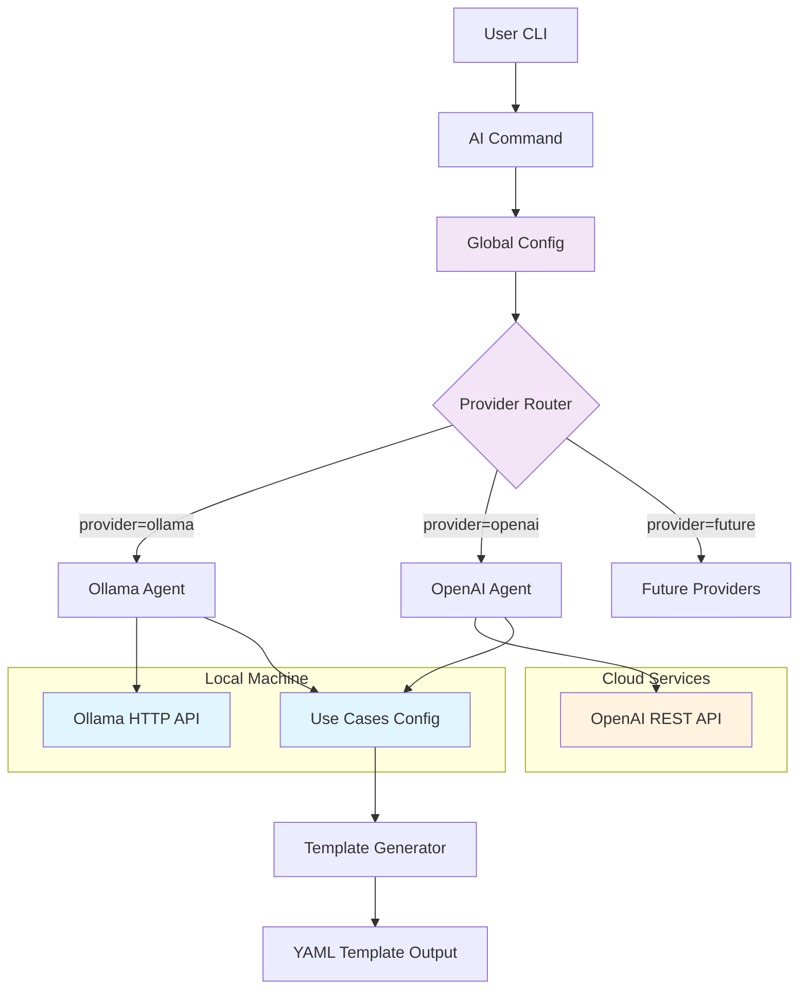
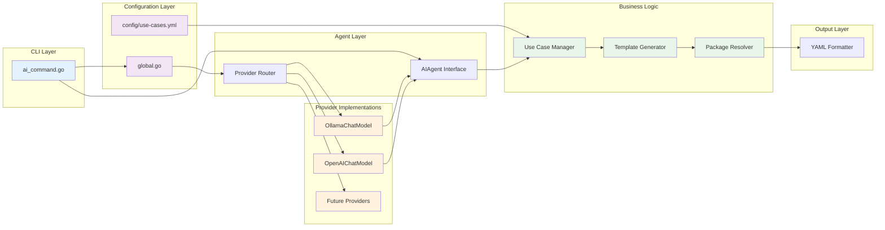
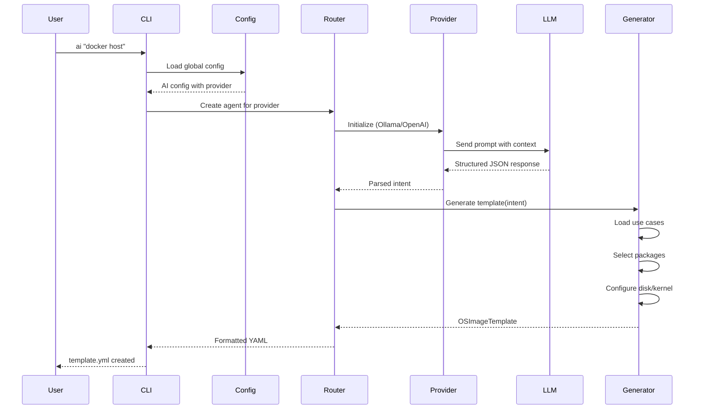

# Architecture Design Record: AI-Powered Template Generation

**Status**: Proposed (Pending Approval)  
**Date**: 2025-10-13  
**Decision Makers**: OS Image Composer Team  
**Technical Story**: Add AI command for natural language template generation

---

## Context and Problem Statement

OS Image Composer users must manually create YAML templates with specific package lists, kernel configurations, and disk layouts. This requires:
- Deep knowledge of package ecosystems
- Understanding of distribution-specific package names
- Manual research for optimal package combinations
- Trial-and-error for dependency resolution

**Problem**: How can we enable users to generate OS image templates from natural language descriptions while maintaining flexibility for different AI providers?

---

## Decision Drivers

1. **User Experience**: Enable non-experts to create valid templates quickly
2. **Cost Flexibility**: Support both free (local) and paid (cloud) AI options
3. **Privacy**: Allow users to keep data local or use cloud services
4. **Extensibility**: Easy to add more AI providers in the future
5. **Offline Capability**: Must work without internet access
6. **Quality**: Generate valid, production-ready templates
7. **Maintainability**: Clean architecture that's easy to extend
8. **Intelligence**: AI should intelligently mix packages from multiple use cases

---

## Considered Options

### Option 1: Single Provider (Ollama Only)
**Pros**: Simple, free, private  
**Cons**: Limited to local LLMs, requires hardware resources

### Option 2: Single Provider (OpenAI Only)
**Pros**: Best quality, no local resources needed  
**Cons**: Costs money, requires internet, privacy concerns

### Option 3: Multi-Provider with Plugin Architecture ✅ **SELECTED**
**Pros**: Maximum flexibility, future-proof, user choice  
**Cons**: More complex implementation

### Option 4: Rule-Based System Only
**Pros**: No external dependencies, deterministic  
**Cons**: Limited flexibility, hard to maintain

---

## Decision Outcome

**Chosen option**: Multi-Provider Architecture with support for:
- **Ollama** (free, local, open-source)
- **OpenAI** (paid, cloud, high-quality)
- **Extensible design** for future providers (Anthropic, Cohere, etc.)

### Rationale

1. **User Freedom**: Users can choose based on their needs (cost, privacy, quality)
2. **Future-Proof**: Easy to add new providers as AI landscape evolves
3. **Best of Both Worlds**: Free option available, premium option for those who want it
4. **No Lock-In**: Switch providers without code changes
5. **Corporate Friendly**: Supports air-gapped environments (Ollama) and enterprise AI services (OpenAI)

---

## Architecture Design

### High-Level Architecture



### Component Architecture



### Data Flow



---

## AI Package Recommendation Strategy

A critical design decision is how the AI recommends packages. Three approaches were considered:

### Approach 1: Single Use Case Matching (Phase 1 - Initial)

**How it works**: AI identifies ONE use case, uses packages only from that use case.

```
User: "openvino with web dashboard"
AI: Identifies use_case = "openvino-inference"
Result: Only OpenVINO packages (missing nginx!)
```

**Limitations**:
- ⌠Cannot combine multiple use cases
- ⌠Limited to predefined package lists
- ⌠Misses obvious package combinations

### Approach 2: Multi-Use-Case Mixing (Phase 2 - Recommended)

**How it works**: AI identifies primary + additional use cases, merges their packages.

```
User: "openvino with web dashboard"
AI: {
  "use_case": "openvino-inference",
  "additional_use_cases": ["web-server"],
  "custom_packages": ["grafana"]
}
Result: OpenVINO + nginx + web packages + grafana
```

**Advantages**:
- ✅ Intelligent package mixing
- ✅ Uses validated use case definitions
- ✅ Maintains package quality control
- ✅ Allows custom package additions

**Implementation**:
```go
// Enhanced TemplateIntent
type TemplateIntent struct {
    UseCase            string   `json:"use_case"`
    AdditionalUseCases []string `json:"additional_use_cases"`  // NEW
    CustomPackages     []string `json:"custom_packages"`       // NEW
    Requirements       []string `json:"requirements"`
    // ... other fields
}

// Enhanced package selection
func (agent *AIAgent) generateTemplate(intent *TemplateIntent) (*OSImageTemplate, error) {
    // Primary use case packages
    packages := agent.useCases.GetPackagesForUseCase(intent.UseCase)
    
    // Mix in additional use cases
    for _, useCase := range intent.AdditionalUseCases {
        additionalPkgs := agent.useCases.GetPackagesForUseCase(useCase)
        packages = append(packages, additionalPkgs...)
    }
    
    // Add custom AI-recommended packages
    packages = append(packages, intent.CustomPackages...)
    
    return uniqueStrings(packages)
}
```

### Approach 3: Full AI Intelligence (Phase 3 - Future)

**How it works**: AI acts as Linux expert, recommends all packages directly.

```
User: "openvino with monitoring dashboard"
AI: Analyzes requirements and recommends:
{
  "packages": [
    "openvino", "opencv", "python3",    # Inference
    "nginx", "certbot",                  # Web server
    "grafana", "prometheus",             # Monitoring
    "python3-flask"                      # Dashboard API
  ],
  "reasoning": "OpenVINO for inference, Flask API, Nginx reverse proxy, Grafana for visualization"
}
```

**Advantages**:
- ✅ Maximum flexibility
- ✅ AI can recommend novel combinations
- ✅ Adapts to any user request

**Challenges**:
- âš ï¸ May recommend non-existent packages
- âš ï¸ Requires robust validation
- âš ï¸ Less predictable results

### Decision: Phased Implementation

**Phase 1** (Initial): Single use case matching
- Simple to implement and test
- Validates core architecture
- Provides immediate value

**Phase 2** (Recommended for approval): Multi-use-case mixing
- Significant intelligence improvement
- Maintains quality control
- Balances flexibility and safety

**Phase 3** (Future consideration): Full AI intelligence
- Requires extensive testing
- Consider after Phase 2 is proven
- May require package validation service

---

## Implementation Details

### 1. Configuration Structure

**File**: `os-image-composer.yml`

```yaml
# Existing configuration
workers: 8
cache_dir: ./cache
work_dir: ./workspace

# Add AI configuration section
ai:
  enabled: true
  provider: ollama  # or "openai"
  
  ollama:
    base_url: http://localhost:11434
    model: llama3.1:8b
    temperature: 0.7
    max_tokens: 2000
    timeout: 120
  
  openai:
    api_key: ${OPENAI_API_KEY}
    model: gpt-4o-mini
    temperature: 0.7
    max_tokens: 2000
    timeout: 120
```

### 2. Use Cases Configuration

**File**: `config/use-cases.yml`

```yaml
# OS Image Composer Use Case Definitions

use_cases:
  web-server:
    name: Web Server
    description: HTTP/HTTPS web server configuration
    keywords:
      - web
      - nginx
      - apache
      - http
      - https
    essential_packages:
      - nginx
      - systemd
      - openssl
    optional_packages:
      - certbot
      - logrotate
    security_packages:
      - ufw
      - fail2ban
    performance_packages:
      - redis
      - memcached
    kernel:
      default_version: "6.12"
      cmdline: "console=ttyS0,115200 console=tty0 loglevel=7"
    disk:
      default_size: "8GiB"

  openvino-inference:
    name: OpenVINO Inference
    description: AI/ML inference with Intel OpenVINO
    keywords:
      - openvino
      - inference
      - ai
      - ml
      - vision
    essential_packages:
      - systemd
      - python3
      - openvino
      - opencv
    optional_packages:
      - python3-numpy
      - intel-opencl
    security_packages:
      - openssl
      - openssh-server
    kernel:
      default_version: "6.12"
      cmdline: "console=ttyS0,115200 intel_iommu=on"
    disk:
      default_size: "20GiB"
```

### 3. Provider Interface

```go
// ChatModel interface - all providers must implement
type ChatModel interface {
    SendMessage(ctx context.Context, message string) (string, error)
    SendStructuredMessage(ctx context.Context, message string, schema interface{}) error
    SetSystemPrompt(prompt string)
    ResetConversation()
}
```

### 4. File Structure

```
os-image-composer/
├── cmd/
│   └── os-image-composer/
│       └── ai_command.go          # CLI command implementation
├── config/
│   └── use-cases.yml              # Use case definitions
├── internal/
│   ├── aiagent/
│   │   ├── types.go               # Shared types
│   │   ├── utils.go               # Shared utilities
│   │   ├── local_agent.go         # Main agent orchestrator
│   │   ├── ollama_client.go       # Ollama provider
│   │   ├── openai_client.go       # OpenAI provider
│   │   └── use_cases.go           # Use case management
│   └── config/
│       ├── global.go              # Global configuration
│       └── schema/
│           ├── os-image-composer-config.schema.json
│           └── use-cases.schema.json  # Validation for use cases
└── os-image-composer.yml          # Global config
```

### 5. Key Design Patterns

**Strategy Pattern**: Different AI providers as interchangeable strategies

```go
type AIAgent struct {
    chatModel ChatModel  // Interface allows swapping providers
    useCases  *UseCasesConfig
}

func NewAIAgent(provider string, config interface{}) (*AIAgent, error) {
    switch provider {
    case "ollama":
        chatModel = NewOllamaChatModel(config)
    case "openai":
        chatModel = NewOpenAIChatModel(config)
    default:
        return nil, fmt.Errorf("unsupported provider: %s", provider)
    }
    // ... rest of initialization
}
```

**Template Method Pattern**: Common workflow, provider-specific implementations

```go
// Common workflow in AIAgent
func (agent *AIAgent) ProcessUserRequest(ctx context.Context, input string) (*OSImageTemplate, error) {
    intent := agent.parseUserIntent(ctx, input)    // Uses provider's SendMessage
    template := agent.generateTemplate(intent)     // Provider-agnostic
    return template, nil
}
```

---

## Provider Comparison

| Feature | Ollama | OpenAI |
|---------|--------|--------|
| **Cost** | Free | ~$0.001 per request |
| **Setup** | Install + download model | API key only |
| **Privacy** | 100% local | Data sent to cloud |
| **Internet** | Not required | Required |
| **Quality** | Very good | Excellent |
| **Speed** | 2-5 seconds | 1-2 seconds |
| **Models** | llama3.1, mistral, etc. | gpt-4o, gpt-4o-mini |
| **Hardware** | 8GB+ RAM | None |
| **Rate Limits** | None | API quota limits |
| **Customization** | Can fine-tune | Limited |

---

## Usage Examples

### Example 1: Using Ollama (Free, Local)

**Step 1**: Enable AI in configuration

Edit `os-image-composer.yml` and add:
```yaml
ai:
  enabled: true
  provider: ollama
  ollama:
    base_url: http://localhost:11434
    model: llama3.1:8b
```

**Step 2**: Install Ollama
```bash
curl -fsSL https://ollama.com/install.sh | sh
ollama pull llama3.1:8b
```

**Step 3**: Generate templates
```bash
# Generate and view
os-image-composer ai "docker host for production"

# Save to file
os-image-composer ai "docker host for production" --output docker-host.yml
```

### Example 2: Using OpenAI (Paid, Cloud)

**Step 1**: Set API key
```bash
export OPENAI_API_KEY="sk-..."
```

**Step 2**: Enable OpenAI in configuration

Edit `os-image-composer.yml` and add:
```yaml
ai:
  enabled: true
  provider: openai
  openai:
    api_key: ${OPENAI_API_KEY}
    model: gpt-4o-mini
```

**Step 3**: Generate templates (same command!)
```bash
os-image-composer ai "docker host for production" --output template.yml
```

### Example 3: Adding Custom Use Case

Edit `config/use-cases.yml`:
```yaml
use_cases:
  gaming-server:
    name: Gaming Server
    keywords: [game, gaming, minecraft, steam]
    essential_packages:
      - systemd
      - game-server-tools
    disk:
      default_size: "50GiB"
```

Use it:
```bash
os-image-composer ai "minecraft gaming server" --output gaming.yml
```

### Example 4: Complex Multi-Use-Case (Phase 2)

```bash
# AI intelligently combines multiple use cases
os-image-composer ai "python web app with redis cache and postgresql database" --output webapp.yml

# Results in packages from:
# - python-web use case
# - Custom additions: redis, postgresql
```

---

## Security Considerations

### 1. API Key Management

**Problem**: OpenAI API keys must be kept secure

**Solution**:
- Use environment variables: `${OPENAI_API_KEY}`
- Never commit keys to version control
- Support `.env` file loading
- Document secure key storage practices

### 2. Prompt Injection

**Problem**: User input could manipulate AI behavior

**Mitigation**:
- Structured JSON responses only
- Schema validation on all outputs
- Sanitize user input
- Use system prompts to constrain behavior

### 3. Data Privacy

**Problem**: Templates might contain sensitive information

**Solution**:
- Default to Ollama (local processing)
- Warn users when using cloud providers
- Document data handling policies
- Allow disabling AI entirely

### 4. Package Validation

**Problem**: AI might recommend non-existent packages

**Mitigation** (Phase 2+):
- Validate packages against repository metadata
- Warn users about unrecognized packages
- Maintain allowlist of known-good packages
- Test generated templates before deployment

---

## Performance Considerations

### Response Time

| Provider | First Request | Subsequent | Notes |
|----------|--------------|------------|-------|
| Ollama | 5-10s | 2-5s | Model loading overhead first time |
| OpenAI | 1-2s | 1-2s | Network latency |

### Resource Usage

**Ollama**:
- RAM: 8GB minimum, 16GB recommended
- Disk: 5-10GB per model
- CPU: Multi-core beneficial

**OpenAI**:
- RAM: Minimal
- Disk: None
- Network: Moderate bandwidth

---

## Testing Strategy

### Unit Tests

```go
func TestAIAgent_MultipleProviders(t *testing.T) {
    providers := []string{"ollama", "openai"}
    
    for _, provider := range providers {
        t.Run(provider, func(t *testing.T) {
            mockConfig := getMockConfig(provider)
            agent, err := NewAIAgent(provider, mockConfig)
            assert.NoError(t, err)
            
            template, err := agent.ProcessUserRequest(ctx, "web server")
            assert.NoError(t, err)
            assert.NotNil(t, template)
        })
    }
}
```

### Integration Tests

```bash
# Test with Ollama
./test-ai.sh ollama "docker host"

# Test with OpenAI (if API key available)
./test-ai.sh openai "docker host"

# Verify output compatibility
./os-image-composer validate generated-template.yml
```

### E2E Tests

```bash
# Full workflow test
os-image-composer ai "web server" --output test.yml
os-image-composer validate test.yml
os-image-composer build test.yml
```

---

## Phase Implementation Plan

### Phase 1: Foundation (For Initial Approval)

**Status**: Implementation Ready  
**Goal**: Establish multi-provider architecture

- ✅ Ollama provider implementation
- ✅ OpenAI provider implementation
- ✅ Provider abstraction interface
- ✅ Single use case matching
- ✅ YAML output only
- ✅ Basic use cases (web-server, python-web, database, embedded, container-host)
- ✅ Configuration system
- ✅ Schema validation

**Deliverables**:
- Functional `ai` command
- Support for Ollama and OpenAI
- Documentation and ADR

### Phase 2: Enhanced Intelligence (Post-Approval)

**Status**: Planned  
**Goal**: Multi-use-case package mixing

- â³ Enhanced AI prompts for multiple use cases
- â³ Package merging from multiple use cases
- â³ Custom package recommendations
- â³ Package validation against repositories
- â³ Warning system for unknown packages
- â³ Extended use case library (AI/ML, gaming, monitoring)

**Deliverables**:
- Smarter package selection
- Better handling of complex requirements
- Comprehensive use case library

### Phase 3: Advanced Features (Future)

**Status**: Under Consideration  
**Goal**: Full AI intelligence and enterprise features

- â³ Full AI package recommendation (no use case constraints)
- â³ Interactive multi-turn conversations
- â³ Template modification ("add Redis to existing template")
- â³ Explanation mode ("why these packages?")
- â³ Comparison mode ("nginx vs apache for my use case")
- â³ Custom model fine-tuning
- â³ Enterprise: Anthropic Claude support
- â³ Enterprise: Audit logging
- â³ Enterprise: Policy enforcement

---

## Migration Guide

### For Existing Users

No migration needed - AI command is additive. Existing workflow unchanged:

```bash
# Still works exactly as before
os-image-composer build my-template.yml
```

### Enabling AI Features

**Step 1**: Update configuration

Edit `os-image-composer.yml`, add AI section:
```yaml
ai:
  enabled: true
  provider: ollama
  ollama:
    base_url: http://localhost:11434
    model: llama3.1:8b
```

**Step 2**: Install Ollama (if using ollama provider)
```bash
curl -fsSL https://ollama.com/install.sh | sh
ollama pull llama3.1:8b
```

**Step 3**: Start using AI
```bash
os-image-composer ai "your request here" --output template.yml
```

---

## Consequences

### Positive

✅ **User Productivity**: Generate templates 10x faster  
✅ **Lower Barrier**: Non-experts can create valid templates  
✅ **Flexibility**: Choose provider based on needs  
✅ **Extensibility**: Easy to add new providers  
✅ **No Breaking Changes**: Existing functionality unaffected  
✅ **Documentation**: Use cases defined declaratively  
✅ **Privacy Options**: Local or cloud processing  

### Negative

âš ï¸ **Complexity**: More code to maintain  
âš ï¸ **Dependencies**: Requires LLM setup (Ollama or API key)  
âš ï¸ **Variability**: AI responses not fully deterministic  
âš ï¸ **Resource Usage**: Ollama requires significant RAM  
âš ï¸ **Learning Curve**: Users need to understand providers  
âš ï¸ **Phase 1 Limitation**: Single use case only (resolved in Phase 2)

### Neutral

🔷 **Configuration**: More config options (but with good defaults)  
🔷 **Testing**: Need to test multiple providers  
🔷 **Documentation**: Additional docs required  

---

## Compliance and Standards

### JSON Schema Validation

All AI-generated templates validated against:
- `os-image-template.schema.json` (UserTemplate schema)
- Ensures compliance with OS Image Composer standards

### Configuration Schema

AI configuration validated against:
- `os-image-composer-config.schema.json`
- Use cases validated against `use-cases.schema.json`
- Enforces proper types, ranges, and required fields

### Security Standards

- API keys via environment variables (12-factor app)
- No sensitive data in logs
- Rate limiting support
- Timeout protections

### Output Standards

- **Format**: YAML only (consistent with OS Image Composer)
- **Validation**: All outputs validated before saving
- **Schema Compliance**: Matches UserTemplate requirements

---

## References

### Internal Documentation

- [CLI Specification](./Updated%20CLI%20Specification.md)
- [Build Process](./os-image-composer-build-process.md)
- [Template Schema](./os-image-template.schema.json)
- [Use Cases Configuration](../config/use-cases.yml)

### External Resources

- [Ollama Documentation](https://ollama.ai/docs)
- [OpenAI API Reference](https://platform.openai.com/docs/api-reference)
- [LLM Best Practices](https://platform.openai.com/docs/guides/prompt-engineering)

### Related ADRs

- ADR-001: Multi-Repository Package Support
- ADR-002: Caching Strategy
- ADR-003: AI-Powered Template Generation (this document)

---

## Appendix: Complete API Surface

### CLI Commands

```bash
os-image-composer ai [prompt]            # Generate template (YAML to stdout)
os-image-composer ai [prompt] --output F # Save to file (YAML)
```

### Configuration API

```go
config.AIEnabled() bool
config.GetAIConfig() AIConfig
```

### Agent API

```go
NewAIAgent(provider string, config interface{}) (*AIAgent, error)
agent.ProcessUserRequest(ctx, input string) (*OSImageTemplate, error)
```

### Provider API

```go
type ChatModel interface {
    SendMessage(ctx, message string) (string, error)
    SendStructuredMessage(ctx, message string, schema interface{}) error
    SetSystemPrompt(prompt string)
    ResetConversation()
}
```

---

## Approval and Review

**Status**: â³ Pending Approval  
**Submitted By**: OS Image Composer AI Team  
**Review Required From**: 
- Technical Lead
- Security Team (for API key handling)
- Product Owner (for user experience)

**Approval Criteria**:
- [ ] Architecture review completed
- [ ] Security review passed
- [ ] Documentation complete
- [ ] Phase 1 implementation tested
- [ ] Migration path validated

**Review Cycle**: Annual or when adding new providers  
**Next Review**: After Phase 2 implementation

---

## Version History

| Version | Date | Changes | Status |
|---------|------|---------|--------|
| 0.1 | 2025-10-01 | Initial draft | Draft |
| 1.0 | 2025-10-13 | Complete ADR with Phase 1 implementation | Proposed |

---

## Open Questions

1. **Use Case File Location**: Should `config/use-cases.yml` be user-editable or internal only?
2. **Phase 2 Timeline**: When should multi-use-case mixing be implemented?
3. **Package Validation**: How strict should validation be in Phase 2?
4. **Enterprise Features**: Which Phase 3 features have highest priority?

---

## Glossary

- **LLM**: Large Language Model (e.g., GPT-4, Llama)
- **Provider**: AI service implementation (Ollama, OpenAI)
- **Use Case**: Predefined package collection for specific scenario
- **Template Intent**: Parsed user requirements from natural language
- **ChatModel**: Interface for LLM communication
