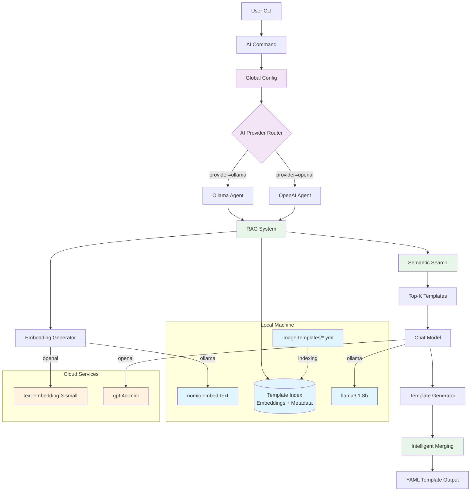
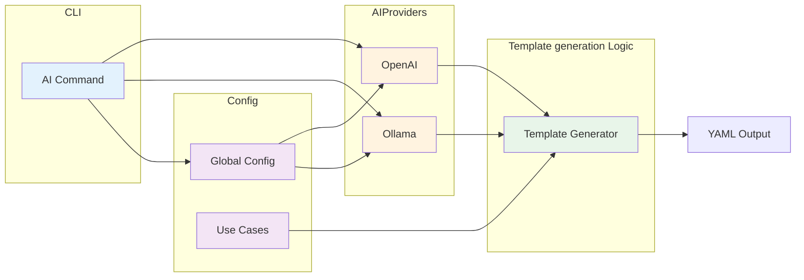
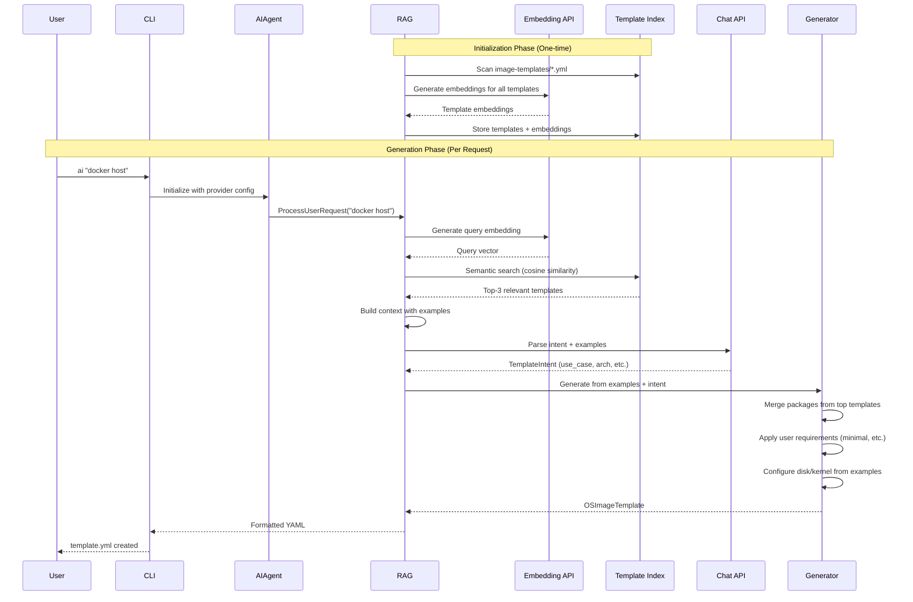
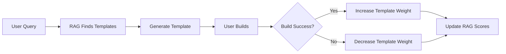

# Architecture Design Record: AI-Powered Template Generation with RAG

**Status**: Proposed (Pending Approval)  
**Date**: 2025-10-23  
**Decision Makers**: OS Image Composer Team  
**Technical Story**: Add AI command for natural language template generation using Retrieval-Augmented Generation

---

## Version History

| Version | Date | Changes | Status |
|---------|------|---------|--------|
| 0.1 | 2025-10-01 | Initial draft | Draft |
| 0.2 | 2025-10-13 | Complete ADR with Phase 1 implementation | Proposed |
| 0.3 | 2025-10-23 | Changed design to RAG-based template generation | Proposed |

---

## Context and Problem Statement

OS Image Composer users must manually create YAML templates with specific package lists, kernel configurations, and disk layouts. This requires:

- Deep knowledge of package ecosystems
- Understanding of distribution-specific package names
- Manual research for optimal package combinations
- Trial-and-error for dependency resolution

**Problem**: How can we enable users to generate OS image templates from natural language descriptions using real working examples as references, while maintaining flexibility for different AI providers?

---

## Decision Drivers

1. **Accuracy**: Generate valid templates based on real working examples
1. **User Experience**: Enable non-experts to create production-ready templates quickly
1. **Cost Flexibility**: Support both free (local) and paid (cloud) AI options
1. **Privacy**: Allow users to keep data local or use cloud services
1. **Extensibility**: Easy to add more AI providers and embedding models
1. **Offline Capability**: Must work without internet access (with local models)
1. **Quality**: Generate valid, production-ready templates
1. **Maintainability**: Clean architecture that's easy to extend
1. **Intelligence**: AI should intelligently merge configurations from relevant examples

---

## Considered Options

### Option 1: Direct LLM Package Recommendation

**Description**: LLM directly recommends all packages without examples.

**Pros**: Simple, no preprocessing needed  
**Cons**: High hallucination risk, may recommend non-existent packages

### Option 2: Use-Case Library (Synthetic Definitions)

**Description**: Predefined use-case YAML files with package lists.

**Pros**: Controlled package sets, no hallucination  
**Cons**: Limited flexibility, requires manual maintenance, cannot learn from real templates

### Option 3: Retrieval-Augmented Generation (RAG) (**SELECTED**)

**Description**: Index real template examples using embeddings, retrieve relevant examples for each request, and generate new templates based on proven configurations.

**Pros**:

- Learns from real working templates
- Reduces hallucination by grounding in examples
- Automatically stays current as templates are added
- Intelligent merging of multiple example patterns
- No manual use-case definitions needed

**Cons**:

- Requires embedding generation (one-time setup cost)
- More complex implementation
- Needs embedding model in addition to chat model

### Option 4: Hybrid (RAG + Use-Case Library)

**Description**: Combine both RAG and predefined use cases.

**Pros**: Maximum flexibility  
**Cons**: Redundant complexity, harder to maintain

---

## Decision Outcome

**Chosen option**: Retrieval-Augmented Generation (RAG) with Multi-Provider Architecture

### Core Components

1. **Template Indexing**: Automatically discover and parse all `.yml` templates in `image-templates/` directory
1. **Embedding Generation**: Convert templates to semantic vectors using:
   - **Ollama**: `nomic-embed-text` (768 dimensions, local, free)
   - **OpenAI**: `text-embedding-3-small` (1536 dimensions, cloud, paid)
1. **Semantic Search**: Find top-K most relevant templates for user query using cosine similarity
1. **Context-Aware Generation**: LLM generates new template based on retrieved examples
1. **Intelligent Merging**: Combine packages and configurations from multiple relevant examples

### Supported AI Providers

- **Ollama** (free, local, open-source) - chat + embeddings
- **OpenAI** (paid, cloud, high-quality) - chat + embeddings
- **Extensible design** for future providers (Anthropic, Cohere, etc.)

### Rationale

1. **Grounded in Reality**: Templates based on real working configurations, not synthetic
1. **Reduces Hallucination**: AI sees actual package lists, kernel configs, disk layouts
1. **Automatic Learning**: Adding new templates automatically expands AI capabilities
1. **No Manual Curation**: No need to maintain separate use-case definition files
1. **User Freedom**: Choose AI provider based on cost, privacy, quality needs
1. **Future-Proof**: Easy to add new providers and embedding models
1. **Corporate Friendly**: Supports air-gapped environments (Ollama) and enterprise AI services (OpenAI)

---

## Architecture Design

### High-Level RAG Architecture



### Component Architecture



### RAG Data Flow



---

## RAG Template Generation Strategy

The RAG system generates templates through intelligent retrieval and merging of real working examples.

### How RAG Works

User Request: "docker host with monitoring"

**Step 1 - Semantic Search:**
Query Embedding: [0.23, -0.45, 0.67, ...]

Template Matches:

- elxr12-x86_64-edge-raw.yml (similarity: 0.89)
  - Packages: docker, containerd, systemd, ...
- azl3-x86_64-minimal-raw.yml (similarity: 0.75)
  - Packages: systemd, bash, coreutils, ...
- azl3-x86_64-dlstreamer.yml (similarity: 0.65)
  - Packages: gstreamer, monitoring tools, ...

**Step 2 - Context-Aware Intent Parsing:**
LLM sees examples and generates:

```bash
{
  "use_case": "container",
  "architecture": "x86_64",
  "distribution": "elxr12",  // from best match
  "custom_packages": ["prometheus", "grafana"]  // user-mentioned
}
```

**Step 3 - Intelligent Merging:**

- Base: elxr12-x86_64-edge-raw.yml (best match) + Packages from high-similarity templates (score > 0.7) + User's custom packages: prometheus, grafana = Final template with 45 packages
- Disk Config: Learned from examples (8GiB, GPT, EFI+rootfs)
- Kernel: From example (6.12, console config)

---

### Key Advantages of RAG Approach

1. **Grounded in Reality**: Packages come from working templates, not imagination
1. **Automatic Learning**: Add new `.yml` file → instantly available to AI
1. **Multi-Template Merging**: Intelligently combines best parts of multiple examples
1. **Contextual Awareness**: Sees full template structure (disk, kernel, repos)
1. **Custom Package Support**: Can add user-requested packages to base template
1. **Quality Filtering**: Only uses high-similarity templates (score > 0.7)
1. **Minimal Filtering**: Automatically reduces package count for "minimal" requests

---

## Implementation Details

### 1. Configuration Structure

**File**: `os-image-composer.yml`

```yaml
# Existing configuration
workers: 8
cache_dir: ./cache
work_dir: ./workspace

# RAG-enabled AI configuration
ai:
  enabled: true
  provider: ollama  # or "openai"
  
  # Template directory for RAG indexing
  templates_dir: ./image-templates  # Directory containing .yml examples
  
  ollama:
    base_url: http://localhost:11434
    model: llama3.1:8b                  # Chat model for generation
    embedding_model: nomic-embed-text   # Embedding model for RAG (768d)
    temperature: 0.7
    max_tokens: 2000
    timeout: 120
  
  openai:
    api_key: <OPENAI_API_KEY>
    model: gpt-4o-mini                         # Chat model for generation
    embedding_model: text-embedding-3-small    # Embedding model for RAG (1536d)
    temperature: 0.7
    max_tokens: 2000
    timeout: 120
```

### 1. Template Directory Structure

The RAG system automatically indexes all `.yml` files in the specified directory:

```text
image-templates/
├── azl3-x86_64-minimal-raw.yml        # Minimal Azure Linux
├── azl3-x86_64-edge-raw.yml           # Edge computing
├── azl3-x86_64-dlstreamer.yml         # Video streaming
├── elxr12-x86_64-minimal-raw.yml      # Minimal Wind River
├── elxr12-x86_64-edge-raw.yml         # Edge with containers
├── emt3-x86_64-minimal-iso.yml        # Minimal EMT ISO
└── ...                                 # More templates

Each template is parsed to extract:
- Distribution, architecture, image type
- Package lists (systemd, docker, etc.)
- Kernel configuration (version, cmdline)
- Disk layout (partitions, sizes)
- Custom repositories
- Use case metadata (auto-inferred from filename/content)
```

**Template Indexing Process**:

1. Scan `templates_dir` for all `.yml` files
1. Parse each template to extract metadata
1. Build searchable text: "Use case: edge. Packages: docker, systemd, ..."
1. Generate embedding vector for each template
1. Store templates + embeddings in memory index
1. Ready for semantic search

**No manual curation needed** - just add `.yml` files and they're automatically available!

---

## AI Provider Comparison (RAG-Enabled)

| Feature | Ollama | OpenAI |
|---------|--------|--------|
| **Cost** | Free | ~$0.001 per request + embeddings |
| **Setup** | Install + download 2 models | API key only |
| **Privacy** | 100% local | Data sent to cloud |
| **Internet** | Not required | Required |
| **Quality** | Very good | Excellent |
| **Speed** | few seconds to minutes, varies by machine configuration (chat + embedding) | 1-2 seconds |
| **Chat Models** | llama3.1:8b, mistral, etc. | gpt-4o, gpt-4o-mini |
| **Embedding Models** | nomic-embed-text (768d) | text-embedding-3-small (1536d) |
| **Embedding Cost** | Free | ~$0.02 per 1M tokens (one-time indexing) |
| **Hardware** | 8GB+ RAM (both models) | None |
| **Rate Limits** | None | API quota limits |
| **Offline RAG** | ✅ Full RAG offline | ❌ Requires internet |
| **Customization** | Can fine-tune both models | Limited |

---

## Usage Examples

### Example 1: Using Ollama with RAG (Free, Local, Offline)

**Step 1**: Install Ollama and download required models

```bash
# Install Ollama
curl -fsSL https://ollama.com/install.sh | sh

# Download chat model (for generation)
ollama pull llama3.1:8b

# Download embedding model (for RAG)
ollama pull nomic-embed-text
```

**Step 2**: Enable RAG in configuration

Edit `os-image-composer.yml`:

```yaml
ai:
  enabled: true
  provider: ollama
  templates_dir: ./image-templates  # RAG template source
  
  ollama:
    base_url: http://localhost:11434
    model: llama3.1:8b               # Chat model
    embedding_model: nomic-embed-text # Embedding model for RAG
    temperature: 0.7
```

**Step 3**: Generate templates (RAG will auto-index on first run)

```bash
# First run: RAG indexes templates (one-time, ~10-30 seconds)
# Output:
# 🔍 Initializing RAG system...
# 📚 Indexing 15 template files...
# 🔮 Generating embeddings for 15 templates...
#    Generated 5/15 embeddings
#    Generated 10/15 embeddings
#    Generated 15/15 embeddings
# ✅ Indexed 15 templates across 5 use cases
```

# Save to file

```bash
os-image-composer ai "docker host for production" --output docker-host.yml
```


### Example 2: Using OpenAI with RAG (Paid, Cloud, Fast)

**Step 1**: Enable OpenAI with RAG in configuration

Edit `os-image-composer.yml`:

```yaml
ai:
  enabled: true
  provider: openai
  templates_dir: ./image-templates  # RAG template source
  
  openai:
    api_key: "sk-..."                       # <OPENAI_API_KEY>
    model: gpt-4o-mini                      # Chat model
    embedding_model: text-embedding-3-small # Embedding model for RAG
    temperature: 0.7
```

**Step 2**: Generate templates (same command, faster embeddings!)

```bash
# First run: RAG indexes templates with OpenAI embeddings (~5-10 seconds)
# Output:
# 🔍 Initializing RAG system...
# 📚 Indexing 15 template files...
# 🔮 Generating embeddings for 15 templates...
#    Generated 15/15 embeddings
# ✅ Indexed 15 templates across 5 use cases

os-image-composer ai "docker host for production" --output template.yml
```

### Example 3: Adding Custom Templates (Automatic RAG Learning)

Simply add a new template file - no configuration needed!

**Create**: `image-templates/my-custom-stack.yml`

```yaml
image:
  name: my-custom-stack
  version: 1.0.0
target:
  os: azure-linux
  dist: azl3
  arch: x86_64
  imageType: raw
systemConfig:
  name: "Custom LAMP Stack"
  description: "Linux + Apache + MySQL + PHP for web hosting"
  packages:
    - systemd
    - apache2
    - mysql-server
    - php
    - php-mysql
    - ssl-cert
  kernel:
    version: "6.12"
disk:
  # ... disk configuration
```

**Use immediately**:

```bash
# RAG automatically finds and uses your new template!
os-image-composer ai "web hosting with MySQL database" --output hosting.yml

# Output:
# 🔎 Finding relevant template examples...
# 📋 Found 3 relevant templates:
#    1. my-custom-stack.yml (similarity: 0.92)  ← Your new template!
#    2. azl3-x86_64-edge-raw.yml (similarity: 0.76)
#    3. ...
```

### Example 4: Complex Multi-Template Merging

```bash
# RAG finds multiple relevant templates and intelligently merges them
os-image-composer ai "video streaming with AI inference and monitoring" --output complex.yml

# RAG Process:
# 1. Finds: dlstreamer template (gstreamer packages)
# 2. Finds: minimal template (base packages)
# 3. Finds: edge template (monitoring tools)
# 4. Merges packages from all high-similarity templates
# 5. Adds custom packages mentioned: [monitoring, inference tools]
# 6. Result: Comprehensive template with required packages
```

---

## Security Considerations

### 1. API Key Management

**Problem**: OpenAI API keys must be kept secure

**Solution**:

- Never commit keys to version control
- Document secure key storage practices

### 1. Data Privacy

**Problem**: Templates might contain sensitive information

**Solution**:

- Default to Ollama (100% local RAG: embeddings + chat)
- Warn users when using cloud providers
- Template content never leaves local system with Ollama
- OpenAI: Only template metadata sent for embeddings (one-time)
- Document data handling policies
- Allow disabling AI entirely

### 1. Package Validation and Hallucination Prevention

**Problem**: Traditional LLMs might recommend non-existent packages

**Solution (RAG Approach)**:

- **All packages come from real templates**
- Packages proven to work in actual builds
- Automatically validated (templates must build successfully to be included)
- Custom packages explicitly marked (user-requested additions)
- Optional: Validate custom packages against repository metadata (future enhancement)
- Warn users about user-requested packages that don't exist in examples

---

## Performance Considerations

### Response Time (with RAG)

| Provider | First Request (with indexing) | Subsequent | Notes |
|----------|-------------------------------|------------|-------|
| Ollama | 10-30s | 3-7s | First run: template indexing + embeddings. Model loading overhead |
| OpenAI | 5-10s | 1-2s | First run: template indexing. Fast batch embeddings |

**RAG Overhead**:
- Initial indexing: One-time per session (~10-30 seconds for 15 templates)
- Semantic search: ~100-500ms per query
- Embedding generation: ~1-2s per query

### Resource Usage (RAG-Enabled)

**Ollama**:

- RAM: 12GB minimum, 16GB+ recommended (chat + embedding models)
- Disk: 10-15GB (llama3.1:8b ~5GB + nomic-embed-text ~300MB)
- CPU: Multi-core beneficial for embedding generation
- Template Index: ~1-5MB in RAM (depends on template count)

**OpenAI**:

- RAM: Minimal (~1-5MB for template index)
- Disk: None
- Network: Moderate bandwidth (initial embedding generation, then minimal)

---

## Testing Strategy

### RAG System Tests

- Test template indexing and parsing
- Test embedding generation (Ollama and OpenAI)
- Test semantic search accuracy
- Test cosine similarity calculations
- Test template metadata extraction

### Integration Tests

- Test end-to-end RAG workflow: query → search → generate → output
- Test both Ollama and OpenAI providers
- Test multi-template merging logic
- Test custom package additions
- Test error handling and fallbacks

### E2E Tests

Examples for E2E testing:

```bash
# Full RAG workflow test
os-image-composer ai "web server with monitoring" --output test.yml
os-image-composer validate test.yml
os-image-composer build test.yml

# Test template similarity
os-image-composer ai "minimal embedded system" --output minimal.yml
# Should find: minimal-*.yml templates with high similarity

# Test multi-template merging
os-image-composer ai "docker with video streaming" --output complex.yml
# Should merge: edge templates (docker) + dlstreamer templates (video)
```

---

## Phase Implementation Plan

### Phase 2 Implementation plan

**Status**: Ready for Approval  
**Goal**: RAG-based template generation

**Implemented Components**:

- RAG System
  - Template indexing and parsing
  - Semantic search with cosine similarity
  - Multi-template merging logic
  
- Embedding Clients
  - Ollama embedding generation (`nomic-embed-text`)
  - OpenAI embedding generation (`text-embedding-3-small`)
  - Batch embedding support
  
- AI Agent Integration
  - RAG-powered intent parsing
  - Context-aware generation with examples
  - Intelligent package merging
  - Custom package support
  
- Multi-Provider Architecture
  - Ollama provider (chat + embeddings)
  - OpenAI provider (chat + embeddings)
  - Provider abstraction interface
  
- Configuration System
  - RAG-enabled configuration (`os-image-composer.yml`)
  - Template directory specification
  - Embedding model selection

**Deliverables**:

- Functional `ai` command with RAG
- Support for Ollama and OpenAI (both chat and embeddings)
- Automatic template indexing
- Real-world example-based generation
- Documentation and ADR

### Future Enhancements

**Post-Approval Considerations**:

- **Embedding Caching**: Cache embeddings to disk to avoid regeneration
- **Incremental Indexing**: Only re-embed changed templates
- **Similarity Threshold Tuning**: Optimize the 0.7 similarity threshold
- **Interactive Mode**: Multi-turn conversations for template refinement
- **Template Explanation**: "Why did you choose these packages?"
- **Comparison Mode**: "Compare nginx vs apache for my use case"
- **Additional Providers**: Anthropic Claude, Cohere embeddings
- **Vector Database**: Consider Qdrant/Milvus for large template collections
- **Fine-tuning**: Custom model training on successful templates

---

## Future Considerations

The following enhancements can be explored after initial RAG implementation:

### Template Management and Curation

**Question**: How should the template collection be managed?

**Current Approach**: RAG automatically indexes all `.yml` files in `image-templates/` directory.

**Future Enhancements**:

1. **Template Quality Scoring**:
   - Rank templates by usage frequency
   - Prioritize well-tested templates in search results
   - Weight similarity scores by template quality

1. **User-Contributed Templates**:
   - Allow users to add custom templates to their local index
   - Organization-specific template repositories
   - Template sharing mechanism (opt-in)

1. **Template Versioning**:
   - Track template changes over time
   - Support multiple versions of same use case
   - Prefer latest/most-stable versions

### RAG Learning and Improvement

**Question**: How can RAG improve over time?

**Current State**: Static RAG - templates and embeddings don't change unless manually updated.

**Future Learning Mechanisms**:

#### Option 1: Usage-Based Learning



- Track which templates lead to successful builds
- Boost similarity scores for proven templates
- Demote rarely-used or failed templates

#### Option 2: Embedding Fine-Tuning

- Collect query → selected-templates pairs
- Fine-tune embedding model to improve search accuracy
- Organization-specific embedding customization

#### Option 3: Dynamic Template Generation

- User-approved generated templates become new RAG examples
- Automatically expand template collection
- Self-improving system

**Recommendation**:

- Near-term: Implement usage-based template weighting
- Mid-term: Fine-tune embedding models on successful queries
- Long-term: Explore dynamic template collection expansion

### Embedding Optimization

**Question**: How to handle large template collections efficiently?

**Current Approach**: In-memory index with linear search (fine for <1000 templates).

**Future Optimizations**:

1. **Vector Databases**:
   - Integrate Qdrant, Milvus, or Weaviate for large collections (>1000 templates)
   - Approximate nearest neighbor search (ANN) for speed
   - Distributed indexing for enterprise deployments

1. **Embedding Caching**:
   - Cache embeddings to disk (avoid regeneration on restart)
   - Incremental updates (only re-embed changed templates)
   - Checksum-based cache invalidation

1. **Hybrid Search**:
   - Combine semantic search (embeddings) with keyword search
   - Boost results that match both semantic and keyword criteria
   - Better handling of specific package names

### Package-Level RAG (Alternative Approach)

**Question**: Can we generate embeddings for individual packages instead of full templates?

**Current Approach**: RAG indexes complete templates as single units.

**Alternative Approach - Package-Level Embeddings**:

Instead of embedding entire templates, create a package knowledge base:

```yaml
# Example: Package Metadata Database
packages:
  docker:
    description: "Container runtime for running and managing containers"
    use_cases: ["container-host", "edge", "cloud-native"]
    requires: ["containerd", "systemd"]
    optional: ["docker-compose", "buildx"]
    distributions:
      azl3: "docker-ce"
      elxr12: "docker"
      emt3: "docker-engine"
    
  nginx:
    description: "High-performance web server and reverse proxy"
    use_cases: ["web-server", "api-gateway", "edge"]
    requires: ["systemd", "openssl"]
    optional: ["certbot", "nginx-module-geoip"]
    distributions:
      azl3: "nginx"
      elxr12: "nginx"
      emt3: "nginx-light"
```

**How it would work**:

1. **Indexing**: Generate embeddings for each package description + metadata
2. **Search**: Query like "container hosting" retrieves relevant packages: docker, containerd, etc.
3. **Composition**: LLM composes template from retrieved packages + their dependencies
4. **Validation**: Cross-reference with templates to ensure package compatibility

**Advantages**:

- More granular control over package selection
- Can handle novel use cases not in template examples
- Better explanation: "I selected docker because it matches container-host use case"
- Distribution-specific package mapping built-in
- Automatic dependency resolution hints

**Challenges**:

- Requires manual package metadata curation
- More complex dependency management
- May miss synergies between packages that work well together
- Risk of incompatible package combinations

**Hybrid Approach** (Recommended for Future):

Combine both approaches:
1. **Template-Level RAG** (current): For holistic, proven configurations
2. **Package-Level RAG** (future): For fine-grained package selection and novel combinations

```text
Example Query: "web server with custom authentication"

Step 1 - Template RAG:
   Finds: web-server templates → base packages (nginx, systemd, openssl)

Step 2 - Package RAG:
   Query: "authentication packages"
   Finds: pam, sssd, oauth2-proxy, keycloak
   
Step 3 - Merge:
   Base template + authentication packages → final template
```

**Implementation Priority**: Consider after initial Template RAG is proven and adopted.

### Advanced RAG Features

**Potential Enhancements**:

- **Multi-Query RAG**: Generate multiple search queries for better coverage
- **Re-ranking**: Use LLM to re-rank search results before generation
- **Contextual Compression**: Summarize large templates before sending to LLM
- **Citation Mode**: Show which templates contributed which packages
- **Interactive Refinement**: Multi-turn conversations to refine generated templates
- **Diff Mode**: "Make this template more like that example"
- **Package-Level RAG**: Hybrid approach combining template-level and package-level embeddings

These features will be prioritized based on user feedback and adoption metrics.

---

## Migration Guide

### For Existing Users

No migration needed - AI command is additive. Existing workflow unchanged:

```bash
# Still works exactly as before
os-image-composer build my-template.yml
```

### Enabling AI Features

**Step 1**: Update configuration

Edit `os-image-composer.yml`, add AI section:

```yaml
ai:
  enabled: true
  provider: ollama
  ollama:
    base_url: http://localhost:11434
    model: llama3.1:8b
```

**Step 2**: Install Ollama (if using ollama provider)

```bash
curl -fsSL https://ollama.com/install.sh | sh
ollama pull llama3.1:8b
```

**Step 3**: Start using AI

```bash
os-image-composer ai "your request here" --output template.yml
```

---

## Consequences

### Positive

- **Grounded Generation**: Templates based on real working examples
- **User Productivity**: Generate templates 10x faster with proven configurations
- **Lower Barrier**: Non-experts can create production-ready templates
- **Automatic Learning**: Adding templates instantly expands AI capabilities
- **Quality Assurance**: Packages come from validated, working templates
- **Flexibility**: Choose provider based on cost, privacy, quality needs
- **Extensibility**: Easy to add new providers and embedding models
- **No Breaking Changes**: Existing functionality unaffected
- **No Manual Curation**: No need to maintain separate use-case definition files
- **Privacy Options**: Full local processing (Ollama) or cloud (OpenAI)
- **Multi-Template Intelligence**: Merges best parts of multiple examples

### Negative

- **Complexity**: More code to maintain (RAG system, embedding clients)
- **Initial Overhead**: First run requires template indexing (~10-30 seconds)
- **Dependencies**: Requires both chat and embedding models
- **Resource Usage**: Ollama requires more RAM (12GB+ vs 8GB for chat-only)
- **Variability**: AI responses not fully deterministic (but grounded in examples)
- **Learning Curve**: Users need to understand RAG concepts and providers
- **Embedding Costs**: OpenAI charges for initial template embedding generation

### Neutral

- **Configuration**: More config options (templates_dir, embedding_model)
- **Testing**: Need to test RAG indexing, search, and merging logic
- **Documentation**: Additional RAG concepts to document
- **Template Quality Dependency**: Output quality depends on example template quality  

---

## Compliance and Standards

### JSON Schema Validation

All AI-generated templates validated against:

- `os-image-template.schema.json` (UserTemplate schema)
- Ensures compliance with OS Image Composer standards

### Configuration Schema

AI configuration validated against:

- Global config validated against `os-image-composer-config.schema.json`
- Use cases validated against `use-cases.schema.json`
- Enforces proper types, ranges, and required fields

### Security Standards

- API keys via environment variables
- No sensitive data in logs

### Output Standards

- **Format**: YAML only
- **Validation**: All outputs validated before saving
- **Schema Compliance**: Matches UserTemplate requirements

---

## CLI Reference

### Basic Command Syntax

```bash
os-image-composer ai [prompt] [flags]
```

### Command Overview

The `ai` command generates OS image templates from natural language descriptions using configured AI providers.

### Arguments

**`[prompt]`** (required)

- Natural language description of desired image configuration
- Must be quoted if contains spaces
- Examples: "web server", "docker host with monitoring", "minimal embedded system"

### Flags

**`--output`** (string)

- Path to save generated YAML template
- Default: Print to stdout
- Example: `--output my-template.yml`

**`--provider`** (string)

- Override AI provider from configuration
- Valid values: `ollama`, `openai`
- Default: Uses provider from `os-image-composer.yml`
- Example: `--provider openai`

**`--model`** (string)

- Override AI model for this request
- Ollama examples: `llama3.1:8b`, `llama3.1:70b`, `mistral`, `codellama`
- OpenAI examples: `gpt-4o`, `gpt-4o-mini`, `gpt-4-turbo`
- Default: Uses model from configuration
- Example: `--model llama3.1:70b`

**`--temperature`** (float)

- Control AI response randomness/creativity
- Range: 0.0 (deterministic) to 2.0 (very creative)
- Default: 0.7
- Lower values (0.1-0.3): More consistent, predictable
- Higher values (0.8-1.5): More creative, varied
- Example: `--temperature 0.3`

**`--timeout`** (integer)

- Maximum time to wait for AI response (seconds)
- Default: 120
- Increase for slower models or complex prompts
- Example: `--timeout 300`

### CLI Usage Examples

**Basic usage - output to stdout:**

```bash
os-image-composer ai "web server with nginx"
```

**Save to file:**

```bash
os-image-composer ai "docker host" --output docker.yml
```

**Override provider:**

```bash
# Use OpenAI instead of configured provider
os-image-composer ai "minimal embedded system" --provider openai --output embedded.yml
```

**Override model:**

```bash
# Use larger model for better quality
os-image-composer ai "complex multi-service setup" --model llama3.1:70b --output complex.yml

# Use smaller model for faster response
os-image-composer ai "simple web server" --model llama3.1:8b --output simple.yml
```

**Adjust creativity:**

```bash
# More deterministic (recommended for production)
os-image-composer ai "production web server" --temperature 0.2 --output prod.yml

# More creative (for exploration)
os-image-composer ai "innovative edge device" --temperature 1.2 --output edge.yml
```

**Increase timeout for complex prompts:**

```bash
os-image-composer ai "complete kubernetes node with monitoring, logging, and security" \
  --timeout 300 \
  --model llama3.1:70b \
  --output k8s-node.yml
```

**Combine multiple flags:**

```bash
os-image-composer ai "optimized openvino inference system" \
  --provider openai \
  --model gpt-4o \
  --temperature 0.3 \
  --output openvino.yml
```

### Environment Variables

The `ai` command respects these environment variables:

**`OPENAI_API_KEY`**
[NOTE: Need to check if yaml template can resolve environment variable]

- OpenAI API authentication key
- Required when using OpenAI provider
- Example: `export OPENAI_API_KEY="sk-..."`

### Output Format

**YAML to stdout (default):**

**File output (`--output` flag):**

- Creates specified file with YAML content
- Overwrites existing file without warning
- Creates parent directories if needed
- Prints confirmation message: `Template saved to: <filename>`

### Integration with Other Commands

The AI-generated templates work seamlessly with other `os-image-composer` commands:

```bash
# Generate template
os-image-composer ai "web server" --output web.yml

# Validate generated template
os-image-composer validate web.yml

# Build image from AI-generated template
os-image-composer build web.yml

# Full workflow
os-image-composer ai "docker host" --output docker.yml && \
  os-image-composer validate docker.yml && \
  os-image-composer build docker.yml
```

### Configuration Precedence

Settings are applied in this order (later overrides earlier):

1. Configuration file (`os-image-composer.yml`)
1. Environment variables
1. Command-line flags

Example:

```bash
# Config file says: provider=ollama, model=llama3.1:8b
# Command overrides: provider stays ollama, but model becomes llama3.1:70b
os-image-composer ai "test" --model llama3.1:70b
```

### Tips and Best Practices

**For Faster Results:**

- Use smaller models: `--model llama3.1:8b`
- Use OpenAI: `--provider openai --model gpt-4o-mini`
- Lower temperature: `--temperature 0.2`
- Keep prompts concise

**For Better Quality:**

- Use larger models: `--model llama3.1:70b` or `--model gpt-4o`
- Increase timeout: `--timeout 300`
- Be specific in prompts: "production web server with nginx, ssl, and monitoring"
- Lower temperature for consistency: `--temperature 0.3`

**For Debugging:**

- Always use `--verbose` flag
- Save output to file: `--output debug.yml`
- Check generated template: `os-image-composer validate debug.yml`
- Review AI provider logs

**For Production:**

- Use deterministic temperature: `--temperature 0.2`
- Always validate: `os-image-composer validate template.yml`
- Test build before deployment
- Review and customize generated template

---

## Appendix A: Glossary

### RAG-Specific Terms

- **RAG (Retrieval-Augmented Generation)**: AI technique that grounds LLM responses in retrieved examples/documents
- **Embedding**: Dense vector representation of text (e.g., [0.23, -0.45, 0.67, ...]) capturing semantic meaning
- **Semantic Search**: Finding similar items by comparing embedding vectors, not just keywords
- **Cosine Similarity**: Measure of similarity between two vectors (0.0 = unrelated, 1.0 = identical)
- **Template Index**: In-memory database of templates with pre-computed embeddings
- **Top-K Search**: Retrieving the K most similar templates to a query

### AI Terms

- **LLM**: Large Language Model (e.g., GPT-4, Llama)
- **Chat Model**: LLM used for conversational generation (e.g., `llama3.1:8b`, `gpt-4o-mini`)
- **Embedding Model**: Specialized model for generating vector embeddings (e.g., `nomic-embed-text`, `text-embedding-3-small`)
- **Provider**: AI service implementation (Ollama, OpenAI)
- **Temperature**: AI parameter controlling randomness in responses (0.0 = deterministic, 2.0 = very creative)
- **Timeout**: Maximum duration to wait for AI provider response before canceling the request

### OS Image Composer Terms

- **Template**: YAML file defining OS image configuration (packages, disk, kernel)
- **Use Case**: Inferred category of template (minimal, edge, dlstreamer, etc.)
- **Custom Packages**: User-requested packages not found in retrieved templates

### Technical Terms

- **Ollama**: Lightweight framework for running LLMs and embedding models locally
- **Indexing**: Process of parsing templates and generating embeddings
- **Batch Embeddings**: Generating multiple embeddings in one API call (efficient)

---

## References

### Internal Documentation

- [CLI Specification](./Updated%20CLI%20Specification.md)
- [Build Process](./os-image-composer-build-process.md)
- [Template Schema](./os-image-template.schema.json)

### External Resources

- [Ollama Documentation](https://ollama.ai/docs)
- [OpenAI API Reference](https://platform.openai.com/docs/api-reference)
- [OpenAI Embeddings Guide](https://platform.openai.com/docs/guides/embeddings)
- [RAG Best Practices](https://www.pinecone.io/learn/retrieval-augmented-generation/)
- [Nomic Embed Text (Ollama)](https://ollama.com/library/nomic-embed-text)
- [LLM Best Practices](https://platform.openai.com/docs/guides/prompt-engineering)
